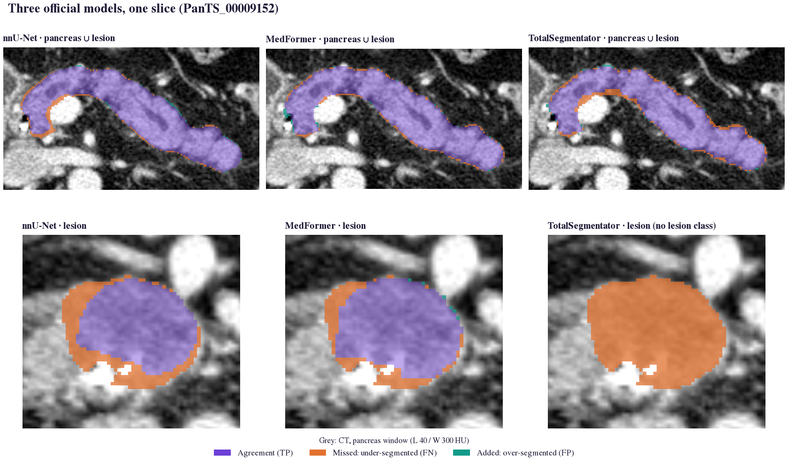
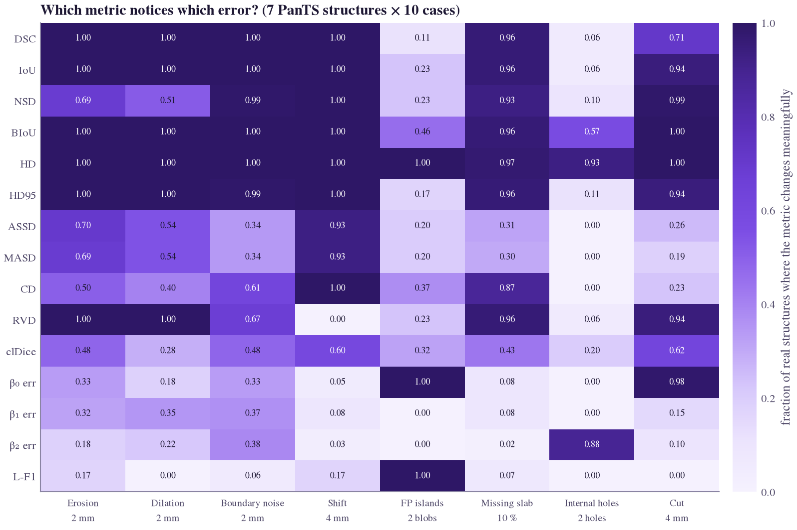
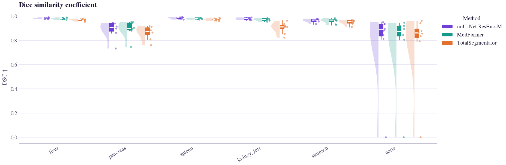
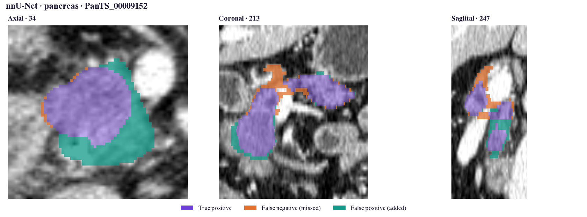
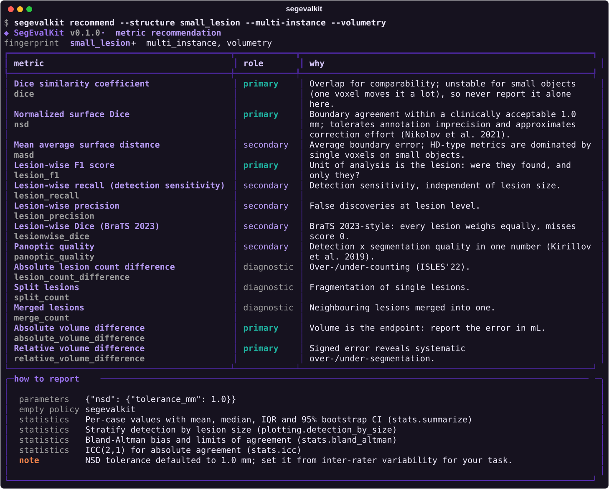

<p align="center">
  <a href="https://aj-das-research.github.io/SegEvalKit/"></a>
</p>

<p align="center">
  <a href="https://aj-das-research.github.io/SegEvalKit/"></a>
  <a href="https://github.com/aj-das-research/SegEvalKit/actions/workflows/tests.yml"></a>
  
  
</p>

<p align="center">
  <a href="https://aj-das-research.github.io/SegEvalKit/getting-started/quickstart/"><b>Quickstart</b></a> &nbsp;·&nbsp;
  <a href="https://aj-das-research.github.io/SegEvalKit/metrics/"><b>Metrics</b></a> &nbsp;·&nbsp;
  <a href="https://aj-das-research.github.io/SegEvalKit/guide/choosing/"><b>Choosing metrics</b></a> &nbsp;·&nbsp;
  <a href="https://aj-das-research.github.io/SegEvalKit/guide/sensitivity-study/"><b>Sensitivity study</b></a> &nbsp;·&nbsp;
  <a href="https://aj-das-research.github.io/SegEvalKit/analysis/plots/"><b>Plot gallery</b></a> &nbsp;·&nbsp;
  <a href="https://aj-das-research.github.io/SegEvalKit/api/"><b>API</b></a>
</p>

<br>

A Dice score alone does not say whether a model finds small tumours, breaks vessels, draws acceptable boundaries,
produces trustworthy probabilities, or really beats the baseline, and the tools that compute the other metrics
disagree silently: HD95 has two definitions in use, MedPy changed what its `assd` computes between versions, and
empty masks are handled in at least four ways. **SegEvalKit** puts 53 metrics behind one standard input/output
interface, makes every convention explicit, tests them against the reference implementations, and adds the
statistics and figures needed to report results you can defend.

<p align="center">
  
</p>
<p align="center"><sub><i>Three official models on one PanTS CT slice. Violet: agreement · orange: missed · teal: added.</i></sub></p>

<table>
<tr>
<td width="33%" valign="top"><b>Every metric family</b><br>Overlap, volume, surface distance, topology, lesion-wise detection, calibration and agreement: 53 metrics sharing one cached computation context.</td>
<td width="33%" valign="top"><b>Explicit, tested conventions</b><br>Empty-mask policies (BraTS, Metrics Reloaded, nnU-Net presets), directed vs pooled HD95, ASSD vs MASD, tolerances; conformance-tested against MONAI, MedPy and DeepMind.</td>
<td width="33%" valign="top"><b>Knows which metric to use</b><br>A Metrics Reloaded-style recommender, a pitfalls catalogue, and a sensitivity study on real CT anatomy showing what each metric notices.</td>
</tr>
<tr>
<td valign="top"><b>A standard interface</b><br>Flat, folder and per-structure NIfTI layouts, geometry checks, structure unions, and one plain-CSV results format.</td>
<td valign="top"><b>Statistics you can defend</b><br>Bootstrap CIs, paired tests with Holm/BH, effect sizes, rankings with bootstrap stability, Bland–Altman, ICC, presence detection.</td>
<td valign="top"><b>See the errors</b><br>Overlays, tri-planar views, montages, 3D surface-distance maps, worst-case galleries, a self-contained HTML report, and a rich terminal UI.</td>
</tr>
</table>

<p align="center">
  
</p>
<p align="center"><sub><i>Which metric notices which error? Measured on 70 real PanTS structures: every metric is blind to something.
<a href="https://aj-das-research.github.io/SegEvalKit/guide/sensitivity-study/">Read the study →</a></i></sub></p>

## Install

```bash
pip install "segevalkit[all] @ git+https://github.com/aj-das-research/SegEvalKit.git@v0.1.0"
```

Extras: `gpu` (PyTorch surface distances) · `sitk` (MHA / NRRD) · `interactive` (plotly 3D maps) · `dev` · `docs`.
Datasets: 25 presets with official protocols (MSD ×10, FLARE22, KiTS19/23, BraTS 2023, AMOS, BTCV, ISLES'22,
autoPET, TopCoW, ACDC, M&Ms, LiTS, SegTHOR, PanTS, TotalSegmentator).

## How to use

Seven steps from a folder of predictions to a report. The outputs shown are real: three official models
(nnU-Net, MedFormer, TotalSegmentator) on 8 PanTS test CTs, chosen to illustrate the library rather than to benchmark it.

**1. Describe what to evaluate.** Structures are named once; each side says where to find them. Here the reference
has one file per structure and nnU-Net writes one multi-label map.

```python
import segevalkit as sek

ev = sek.Evaluator(
    labels={
        "pancreas":          {"ref_file": "pancreas.nii.gz+pancreatic_lesion.nii.gz", "pred": [17, 18, 19, 20, 21, 28]},
        "pancreatic_lesion": {"ref_file": "pancreatic_lesion.nii.gz", "pred": 28, "metrics": ["default", "detection"]},
        "liver":             {"ref_file": "liver.nii.gz", "pred": 14},
    },
    metrics="default", params={"nsd": {"tolerance_mm": 2.0}}, min_lesion_voxels=10,
)
```

**2. Evaluate a folder, then summarise.** One call scores every case; `summary()` gives mean, median and a 95 %
bootstrap confidence interval per structure and metric.

```python
res = ev.evaluate("predictions/nnunet/", "PanTS/LabelTe/", n_workers=8, out_dir="eval/nnunet")
res.summary().query("metric in ['dice', 'nsd', 'hd95']")
```

```text
            label metric  n    mean  median  ci_low  ci_high
         pancreas   dice  8   0.889   0.905   0.840    0.927
         pancreas    nsd  8   0.843   0.887   0.757    0.915
         pancreas   hd95  8   5.925   2.890   2.575   10.228
pancreatic_lesion   dice  8   0.350   0.204   0.097    0.619
pancreatic_lesion    nsd  8   0.311   0.196   0.075    0.561
pancreatic_lesion   hd95  8 290.878 252.815 100.865  481.879
            liver   dice  8   0.981   0.981   0.978    0.985
            liver    nsd  8   0.937   0.948   0.915    0.958
            liver   hd95  8   6.264   2.394   2.032   11.556
```

The lesion rows show why the empty-mask policy matters: in tumour-free patients a spurious lesion prediction scores
Dice 0 and the image-diagonal HD95 penalty, which is what drags the lesion HD95 to hundreds of millimetres.

**3. Find the failures.** Per-case values and the worst cases are one call away.

```python
res.worst_cases("dice", "pancreas", k=3)
```

```text
       case_id  dice
PanTS_00009746 0.733
PanTS_00009287 0.862
PanTS_00009322 0.881
```

**4. Look at lesions, not voxels.** The lesion table shows what the Dice average hides: nnU-Net detected 3 of the
7 reference lesions in these cases and missed a 23.7 mL tumour entirely.

```python
res.lesions.query("kind == 'ref'")[["case_id", "volume_ml", "detected", "dice"]]
```

```text
       case_id  volume_ml  detected  dice
PanTS_00009287      0.145     False 0.000
PanTS_00009287      0.103     False 0.000
PanTS_00009760     23.745     False 0.000
PanTS_00009027      0.181     False 0.000
PanTS_00009152     15.251      True 0.778
PanTS_00009329      2.187      True 0.702
PanTS_00009544      9.765      True 0.666
```

**5. Compare and rank models** with paired tests (Holm-corrected) and challenge-style rankings.

```python
from segevalkit.stats import compare, rank_methods
compare(res_nnunet, res_medformer, metrics=["dice", "nsd", "hd95"], labels=["pancreas"])
rank_methods({"nnU-Net": res_nnunet, "MedFormer": res_medformer, "TotalSegmentator": res_ts}, "dice", label="pancreas")
```

```text
   label metric  n  mean_a  mean_b  mean_diff  frac_a_better  p_adjusted
pancreas   dice  8   0.889   0.894     -0.005          0.250       0.445
pancreas    nsd  8   0.843   0.858     -0.016          0.125       0.445
pancreas   hd95  8   5.925   5.785      0.139          0.250       0.445

          method  mean  rank
       MedFormer 0.894   1.0
nnU-Net ResEnc-M 0.889   2.0
TotalSegmentator 0.863   3.0
```

With 8 cases no difference is significant (adjusted p = 0.445): exactly what the paired test is for.

**6. Plot and look.** Figures use one colour-vision-safe palette: violet agreement, orange missed, teal added.

```python
sek.plotting.metric_distribution({"nnU-Net": r1, "MedFormer": r2, "TotalSegmentator": r3}, "dice", labels=organs)
sek.viz.triplanar(ct, pred_pancreas, ref_pancreas, affine=ref.affine, window="pancreas")
```

<p align="center">
  
</p>
<p align="center">
  
</p>
<p align="center">
  
</p>

**7. Report.** One self-contained HTML file with provenance, tables, figures, the worst cases and a metric glossary:
[open the sample report](https://aj-das-research.github.io/SegEvalKit/assets/showcase/report_nnunet.html).

```python
sek.report.build_report(res, "eval/nnunet/report.html", image_source="PanTS/ImageTe/")
```

The same workflow from the command line:

```console
$ segevalkit evaluate --config eval_nnunet.yaml --report     # the labels above, as YAML
$ segevalkit compare eval/nnunet eval/medformer --out comparison/
$ segevalkit recommend --structure small_lesion --multi-instance
```

<p align="center"></p>

## Documentation

Full documentation, including the metric catalogue with equations and plain-language explanations, the decision
guide, the pitfalls catalogue, the conformance report and the benchmark results, is at
**https://aj-das-research.github.io/SegEvalKit/** (source in [`docs/`](docs)).

The two literature studies behind the library are in [`research/`](research):
[metrics review](research/metrics_literature_review.md) · [datasets & benchmarks survey](research/datasets_benchmarks_survey.md).

## Repository layout

```text
src/segevalkit/     library: metrics/, io/, stats/, plotting/, viz/, report/, guide/, datasets.py, synthetic.py, cli.py
tests/              unit, conformance (MONAI / MedPy / DeepMind) and end-to-end tests
docs/               MkDocs Material site (purple theme)
benchmarks/         reproducible studies: metric sensitivity on real anatomy, PanTS benchmark with official models
research/           literature review and dataset survey
slurm/, scripts/    cluster launchers and environment setup
```

## Citation

```bibtex
@software{das2026segevalkit,
  title  = {SegEvalKit: Holistic Evaluation of Volumetric Medical Image Segmentation},
  author = {Das, Abhijit},
  year   = {2026},
  url    = {https://github.com/aj-das-research/SegEvalKit}
}
```

Please also cite the original papers of the metrics and datasets you use; each metric's documentation page lists them.

## License

Apache-2.0. Dataset presets describe public datasets; each dataset keeps its own licence.
