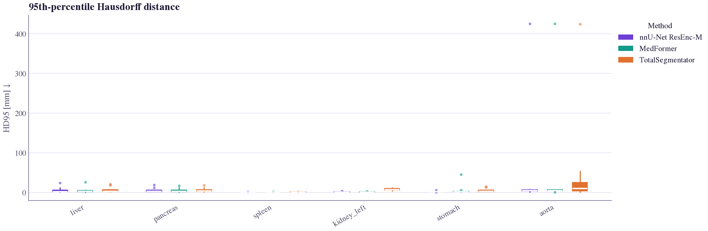
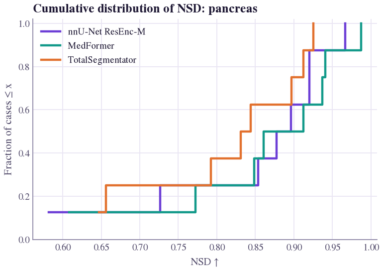
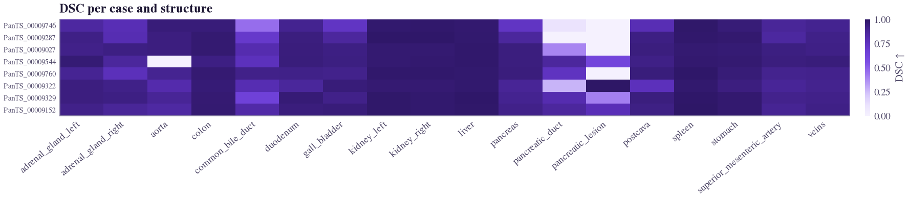
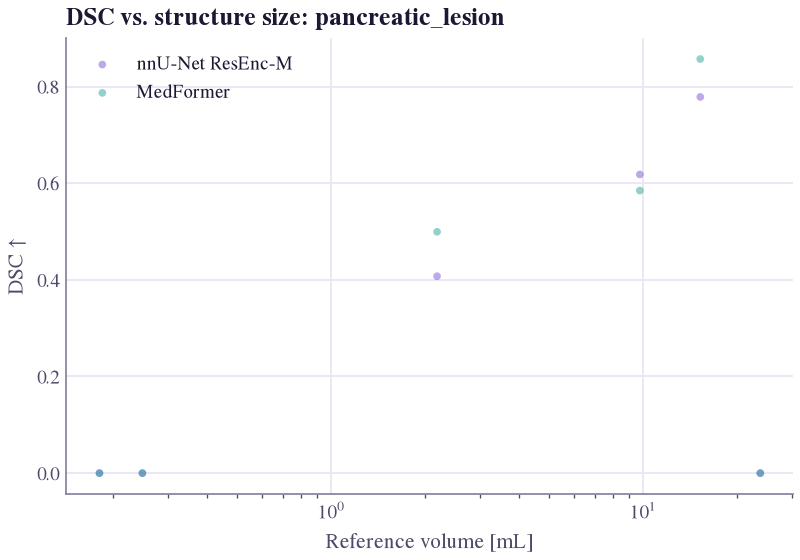
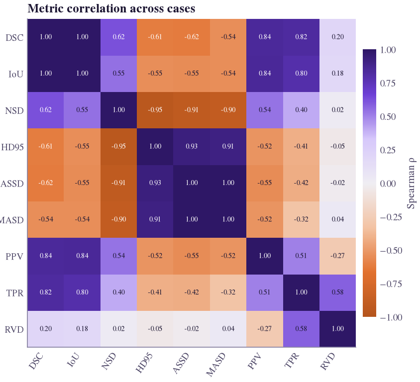
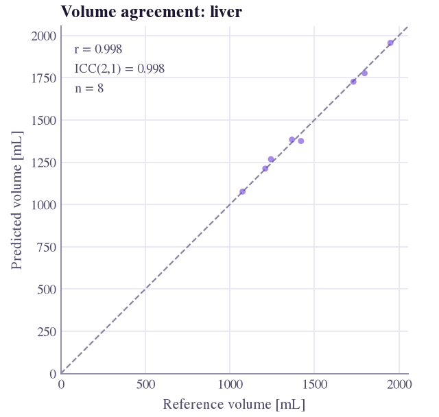
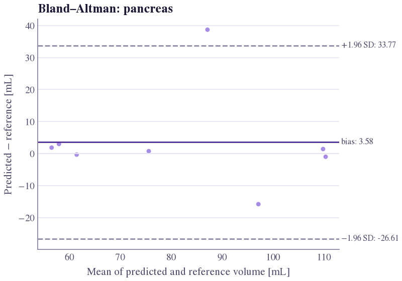
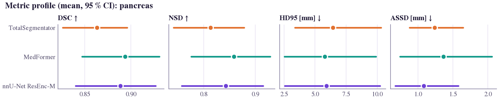
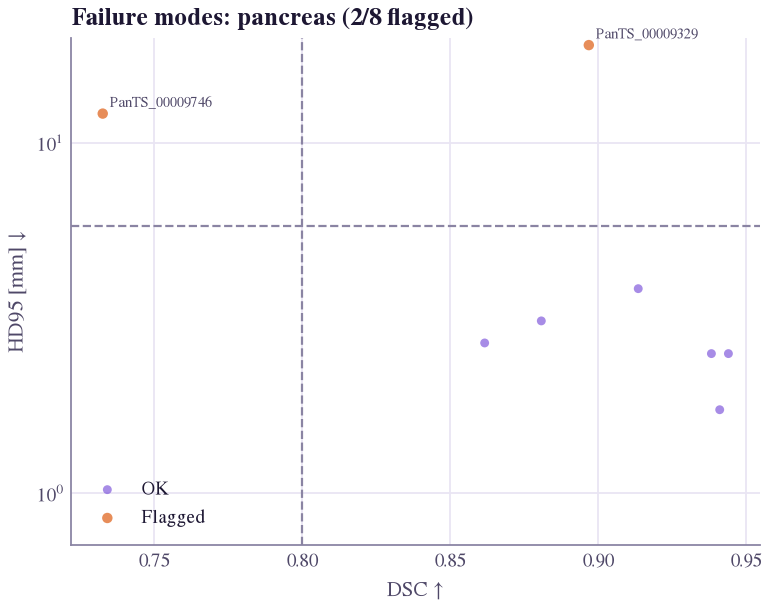
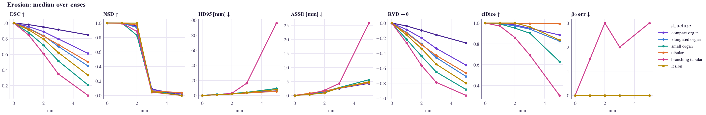

# Quantitative plots

`segevalkit.plotting` turns results into publication-ready figures. Every function takes one
`EvaluationResult` **or** a mapping `{method: EvaluationResult}`, labels axes with unit and better direction
(e.g. `HD95 [mm] ↓`), keeps each method's colour fixed across figures ([purple theme](../developer/plots-and-themes.md)),
and returns a matplotlib `Figure` (or draws on `ax=`).

```python
from segevalkit import plotting as P
import segevalkit as sek

res = sek.load_results("eval_nnunet/")
fig = P.metric_distribution(res, "dice")
fig.savefig("dice.pdf")                      # vector for papers
fig.savefig("dice.png", dpi=200)             # raster for slides
```

## Which plot answers which question?

| Question | Function | Notes |
|---|---|---|
| How are per-case values distributed? | [`metric_distribution`](#distributions) | raincloud (default), box, violin or strip |
| Does one method dominate across the distribution? | [`ecdf`](#distributions) | tails visible, unlike a bar of means |
| Which cases fail, on which structures? | [`metric_heatmap`](#per-case-heatmap) | worst cases first |
| Is the metric biased by structure size? | [`metric_vs_size`](#size-dependence) | log-volume axis, binned median |
| Which metrics are redundant? | [`metric_correlation`](#metric-redundancy) | Spearman across cases |
| Is the volume right? | [`volume_agreement`, `bland_altman_plot`](#volume-agreement) | identity plot with ICC; bias and limits |
| How do methods compare on several metrics? | [`metric_profile`](#comparing-methods) | small multiples with bootstrap CIs |
| Is A significantly better than B? | [`comparison_forest`](#comparing-methods) | paired differences from `stats.compare` |
| How stable is the ranking? | [`ranking_stability_plot`](#ranking-stability) | bootstrap blob plot |
| Are probabilities calibrated? | [`reliability_diagram`](#calibration) | top-label reliability with gap |
| Are small lesions found? | [`detection_by_size`](#lesion-detection) | detection rate per size bin |
| What kind of failure is it? | [`failure_quadrants`](#failure-modes) | Dice vs HD95, flagged cases |
| What does each metric respond to? | [`sensitivity_curves`](#sensitivity-curves) | `segevalkit.synthetic` studies |

!!! info "Real outputs"
    Every figure below was drawn by the function it illustrates, from three official models (nnU-Net ResEnc-M,
    MedFormer, TotalSegmentator) on 8 PanTS test CTs: 2 large, 2 medium and 2 small tumours, 2 tumour-free.
    Eight cases illustrate the library; they are not a benchmark. The pancreas is scored as pancreas ∪ lesion
    ([why](../guide/pitfalls.md#annotation-conventions)).

## Distributions

```python
P.metric_distribution(res, "dice", labels=["liver", "pancreas", "pancreatic_lesion"])
P.metric_distribution({"nnU-Net": r1, "MedFormer": r2}, "nsd", kind="box")
P.ecdf({"nnU-Net": r1, "MedFormer": r2}, "dice", label="pancreas")
```

The raincloud shows shape (half-violin), median and IQR (box) and every case (points). In an ECDF, the curve
further right dominates for higher-is-better metrics.

=== "Raincloud"

    <figure class="sk-fig sk-fig--wide" markdown>
    [](../assets/showcase/dist_dice.png)
    <figcaption>How are per-case values distributed? Dice of three models on six structures. Each model has one aorta case at Dice 0, which a bar of means would hide.</figcaption>
    </figure>

=== "Box"

    <figure class="sk-fig sk-fig--wide" markdown>
    [](../assets/showcase/dist_hd95_box.png)
    <figcaption>The same cases as HD95 with <code>kind="box"</code>: one aorta outlier near 425 mm per model dwarfs every other value.</figcaption>
    </figure>

=== "ECDF"

    <figure class="sk-fig sk-fig--plot" markdown>
    [](../assets/showcase/ecdf_nsd_pancreas.png)
    <figcaption>Does one method dominate? Pancreas NSD at 2 mm: TotalSegmentator lies left over most of the range, but no curve is right of the others everywhere.</figcaption>
    </figure>


## Per-case heatmap

```python
P.metric_heatmap(res, "dice", max_cases=60)
```

Rows are cases (worst first), columns structures: a dark row is a case failure, a dark column a structure failure.

<figure class="sk-fig sk-fig--strip" markdown>
[](../assets/showcase/heatmap_dice.png)
<figcaption>Which cases fail, on which structures? nnU-Net, 8 cases × 18 structures: the pale columns are the pancreatic lesion and duct. Tumour-free PanTS_00009746 scores lesion Dice 0 for a spurious prediction; tumour-free PanTS_00009322, correctly left empty, scores 1.</figcaption>
</figure>

## Size dependence

```python
P.metric_vs_size(res, "dice", label="pancreatic_lesion")
P.metric_vs_size({"A": r1, "B": r2}, "nsd", label="pancreatic_lesion")
```

Reference volume on a log axis with a binned median. Dice and IoU drop on small structures even for constant-thickness
boundary errors ([pitfalls](../guide/pitfalls.md)).

<figure class="sk-fig sk-fig--plot" markdown>
[](../assets/showcase/size_lesion_dice.png)
<figcaption>Is the metric biased by size? Lesion Dice against lesion volume for the two models with a lesion class: both score 0 on every lesion under 1 mL, and both miss the 23.7 mL tumour.</figcaption>
</figure>

## Metric redundancy

```python
metrics = ["dice", "iou", "nsd", "hd95", "assd", "masd", "precision", "recall"]
P.metric_correlation(res, metrics, label="pancreas")
```

Dice and IoU are monotone transforms of each other (ρ = 1), so report one. Weakly correlated metrics capture
different failure modes.

<figure class="sk-fig sk-fig--square" markdown>
[](../assets/showcase/metric_correlation.png)
<figcaption>Which metrics are redundant? nnU-Net, every case and structure: Dice–IoU and ASSD–MASD at ρ = 1.00, NSD–HD95 at −0.95. RVD is nearly independent of the rest.</figcaption>
</figure>

## Volume agreement

```python
P.volume_agreement(res, "liver")                  # predicted vs reference, r and ICC(2,1)
P.bland_altman_plot(res, "liver")                 # bias and 95 % limits of agreement, mL
P.bland_altman_plot(res, "liver", relative=True)  # differences as % of the mean
```

=== "Volume agreement"

    <figure class="sk-fig sk-fig--square" markdown>
    [](../assets/showcase/volume_agreement_liver.png)
    <figcaption>Is the volume right? nnU-Net liver volumes: r = 0.998, ICC(2,1) = 0.998 over 8 cases.</figcaption>
    </figure>

=== "Bland–Altman"

    <figure class="sk-fig sk-fig--plot" markdown>
    [](../assets/showcase/bland_altman_pancreas.png)
    <figcaption>nnU-Net pancreas: bias +3.58 mL, 95 % limits of agreement −26.61 to +33.77 mL; one case lies above the upper limit.</figcaption>
    </figure>


## Comparing methods

```python
from segevalkit.stats import compare

P.metric_profile({"nnU-Net": r1, "MedFormer": r2, "TotalSegmentator": r3},
                 ["dice", "nsd", "hd95", "assd"], label="pancreas")
P.comparison_forest(compare(r1, r2, metrics=["dice", "nsd", "hd95"]),
                    name_a="nnU-Net", name_b="MedFormer")
```

The profile keeps each metric on its own axis and direction (radar charts cannot). The forest plot normalises
differences by the larger mean so units share one axis; filled markers are significant after correction, with the
adjusted p-value beside each row.

=== "Profile"

    <figure class="sk-fig sk-fig--strip" markdown>
    [](../assets/showcase/metric_profile_pancreas.png)
    <figcaption>How do methods compare on several metrics? Pancreas mean with 95 % bootstrap CI: the intervals of the three models overlap on every metric.</figcaption>
    </figure>

=== "Forest"

    <figure class="sk-fig sk-fig--plot" markdown>
    [](../assets/showcase/comparison_forest.png)
    <figcaption>Is A better than B? nnU-Net − MedFormer on four structures, Holm-corrected: every marker is hollow, so no difference is significant on 8 cases.</figcaption>
    </figure>


## Ranking stability

```python
from segevalkit.stats import ranking_stability

stab = ranking_stability({"nnU-Net": r1, "MedFormer": r2, "TotalSegmentator": r3}, "dice",
                         label="pancreas", n_boot=1000)
P.ranking_stability_plot(stab)
```

Blob area is the fraction of bootstrap samples giving a method that rank; the orange bar is the full-data rank and
the line the 95 % rank interval. The title gives the median Kendall τ (Wiesenfarth et al. 2021).

<figure class="sk-fig sk-fig--square" markdown>
[](../assets/showcase/ranking_stability.png)
<figcaption>How stable is the ranking? Pancreas Dice, 300 bootstrap samples: median Kendall τ = 1.00, yet MedFormer and nnU-Net swap ranks in some samples; TotalSegmentator stays third.</figcaption>
</figure>

## Calibration

```python
P.reliability_diagram(probabilities, labels, n_bins=15)
```

Bars show accuracy per confidence bin; the shaded part is the gap to confidence. For 3D volumes pass voxels from a
band around the structure ([ECE](../metrics/calibration.md#ece), `roi="band"`), or background dominates.

<figure class="sk-fig sk-fig--square" markdown>
[](../assets/showcase/reliability_medformer_lesion.png)
<figcaption>Are probabilities calibrated? MedFormer lesion probabilities in a 10 mm band, pooled over cases: every bar falls short of the diagonal (over-confidence), ECE = 0.108.</figcaption>
</figure>

## Lesion detection

```python
P.detection_by_size({"nnU-Net": r1, "MedFormer": r2}, label="pancreatic_lesion",
                    bins_ml=(0, 0.1, 0.5, 1, 5, 20, float("inf")))
```

Uses the per-lesion table (`res.lesions`) from the detection metrics. Each bar is the detected fraction of
reference lesions in a size bin, with the lesion count printed in the bar.

<figure class="sk-fig sk-fig--plot" markdown>
[](../assets/showcase/detection_by_size.png)
<figcaption>Are small lesions found? Neither model detects a lesion under 1 mL; both find the two 1–10 mL lesions and one of the two above 10 mL.</figcaption>
</figure>

## Failure modes

```python
P.failure_quadrants(res, "pancreas", x="dice", y="hd95", x_thr=0.7)
```

Good Dice with large HD95 means distant false-positive fragments; poor Dice with small HD95 means boundary shift or
under-segmentation. Flagged case ids can be inspected with the [qualitative views](qualitative.md).

<figure class="sk-fig sk-fig--plot" markdown>
[](../assets/showcase/failure_quadrants_pancreas.png)
<figcaption>What kind of failure is it? nnU-Net pancreas, Dice threshold 0.8: PanTS_00009329 has good Dice (0.90) but HD95 19.0 mm, a large localised error; PanTS_00009746 is poor on both (0.73, 12.1 mm).</figcaption>
</figure>

## Sensitivity curves

```python
from segevalkit import synthetic

df = synthetic.sensitivity_study([("case", ref_mask, spacing)],
                                 ["dice", "nsd", "hd95", "cldice"],
                                 perturbations={"erode": [0, 1, 2, 3], "cut": [0, 2, 4]})
P.sensitivity_curves(df, ["dice", "nsd", "hd95", "cldice"])
```

One panel per perturbation: median metric vs magnitude, IQR shaded.

<figure class="sk-fig sk-fig--strip" markdown>
[](../assets/figures/sensitivity_erode.png)
<figcaption>What does each metric respond to? Erosion applied to real PanTS reference masks; the full study is the
<a href="../../guide/sensitivity-study/">sensitivity study</a>.</figcaption>
</figure>

## Styling your own figures

```python
import matplotlib.pyplot as plt
from segevalkit.plotting import theme, CATEGORICAL

with theme():                      # SegEvalKit rcParams, scoped
    fig, ax = plt.subplots()
    ax.plot(x, y, color=CATEGORICAL[0])
```

`apply_theme()` sets the theme globally. Figures use a Times-style serif (STIX) that matches LaTeX papers.
