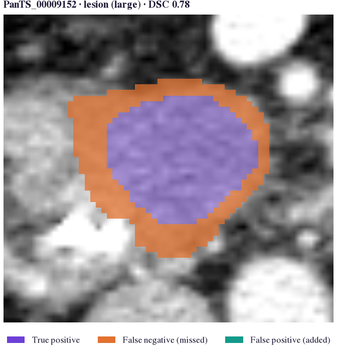
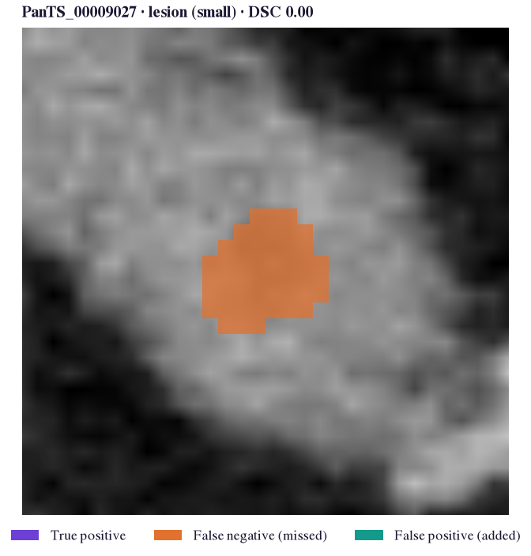
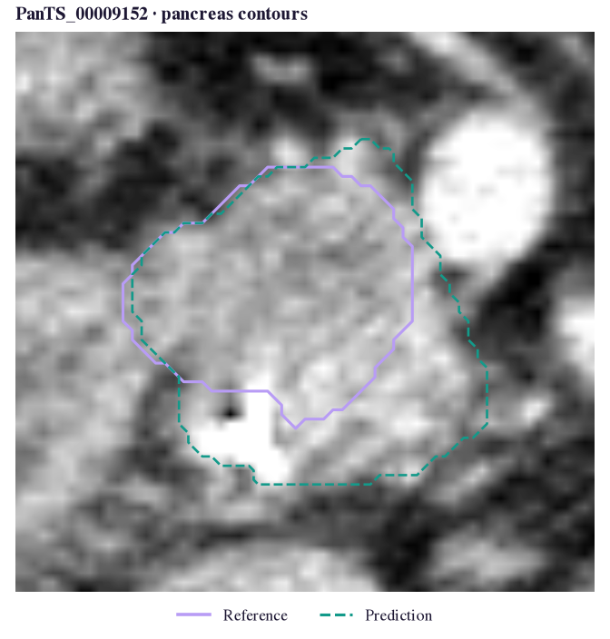
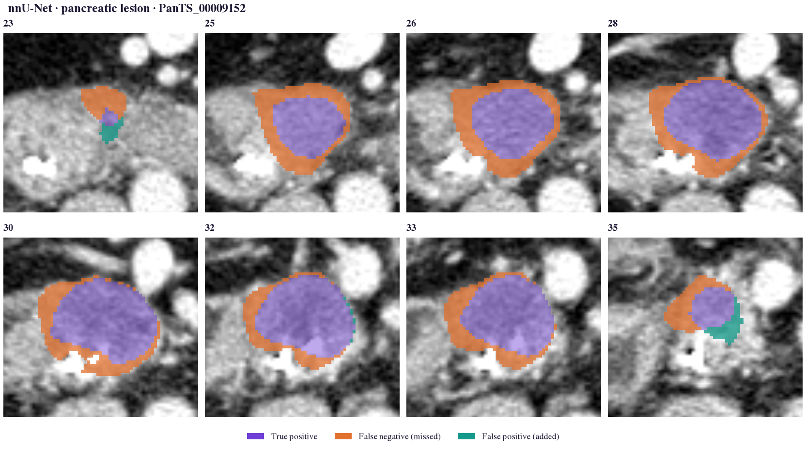
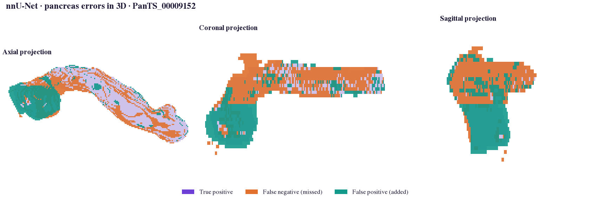
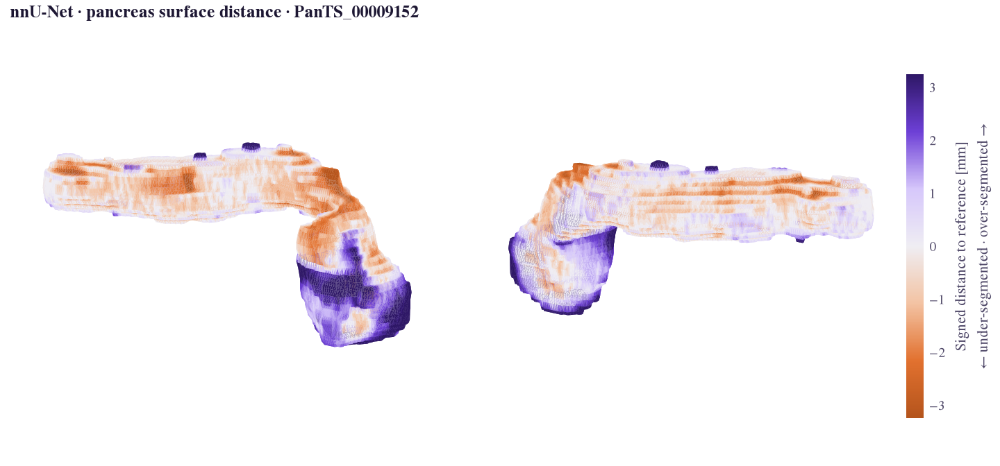
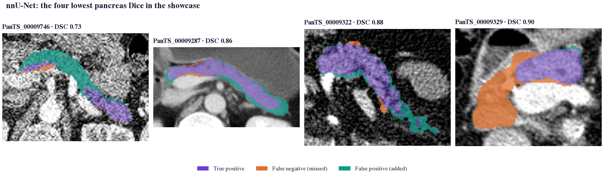

# Qualitative visualisation

Numbers say *how much* is wrong; pictures say *what*. `segevalkit.viz` draws errors on the image with one
encoding in every view:

| Colour | Meaning |
|---|---|
| violet | true positive: prediction and reference agree |
| orange | false negative: reference tissue the model **missed** |
| teal | false positive: tissue the model **added** |

The three colours stay distinguishable under protanopia, deuteranopia and tritanopia simulation
([plots and themes](../developer/plots-and-themes.md)).

## Orientation and geometry

Views reorient to RAS via the NIfTI affine and display in the **radiological convention** (patient right on
screen left; anterior left in sagittal), with aspect ratio from the voxel spacing, so any stored orientation (PanTS
mixes IPL, LPS and RAS) looks the same. `pick_slice` chooses the slice:

| `mode` | Slice chosen |
|---|---|
| `"error"` (default) | the slice with the most false-positive plus false-negative voxels |
| `"ref"` | the slice with the largest reference area |
| `"center"` | the slice through the reference centroid |

`window=` takes a CT preset (`"abdomen"`, `"liver"`, `"pancreas"`, `"lung"`, `"bone"`, `"brain"`, `"angio"`, ...),
a `(level, width)` pair, or `None` for a percentile stretch (MR).

## Views

```python
from segevalkit import viz
from segevalkit.io import load_volume

img = load_volume("ct.nii.gz", kind="image")
ref = load_volume("labels/pancreas.nii.gz")
pred = load_volume("pred/pancreas.nii.gz")
P, G = pred.data > 0, ref.data > 0

A = ref.affine
viz.error_overlay(img.data, P, G, affine=A, window="pancreas")  # one slice, for a figure
viz.error_overlay(img.data, P, G, affine=A, style="contour")    # boundaries only
viz.triplanar(img.data, P, G, affine=A)                         # axial, coronal, sagittal
viz.slice_montage(img.data, P, G, affine=A, n=8)                # follow an error in depth
viz.error_projection(P, G, affine=A)                            # 3D view: distant islands
viz.surface_distance_map(P, G, ref.spacing)                     # boundary errors in mm
viz.case_gallery(items)                                         # worst cases side by side
```

All views zoom to the structure (`zoom=True`) and return a matplotlib figure.

### On real data

Every view below is a real output: nnU-Net ResEnc-M on PanTS test CTs, drawn by the call named in the tab. These
cases illustrate the library; they are not a benchmark. The pancreas is scored as pancreas ∪ lesion
([why](../guide/pitfalls.md#annotation-conventions)).

=== "Overlay"

    <figure class="sk-fig sk-fig--sm" markdown>
    [](../assets/showcase/overlay_lesion_large.png)
    <figcaption><code>error_overlay</code>: a 15.3 mL tumour (PanTS_00009152), Dice 0.78. The core is found; a rim of tumour is missed.</figcaption>
    </figure>

=== "Small lesion"

    <figure class="sk-fig sk-fig--sm" markdown>
    [](../assets/showcase/overlay_lesion_small.png)
    <figcaption>A 0.18 mL lesion (PanTS_00009027) missed entirely: Dice 0. Small lesions are where lesion-wise metrics matter.</figcaption>
    </figure>

=== "Contour"

    <figure class="sk-fig sk-fig--sm" markdown>
    [](../assets/showcase/contour_pancreas.png)
    <figcaption><code>style="contour"</code>: reference in lavender, prediction in dashed teal; the prediction extends below the reference.</figcaption>
    </figure>

=== "Tri-planar"

    <figure class="sk-fig" markdown>
    [](../assets/showcase/triplanar_pancreas.png)
    <figcaption><code>triplanar</code>: axial, coronal and sagittal slices through the region of largest error; added (teal) and missed (orange) tissue show up in different planes.</figcaption>
    </figure>

=== "Montage"

    <figure class="sk-fig" markdown>
    [](../assets/showcase/montage_lesion.png)
    <figcaption><code>slice_montage</code>, 8 evenly spaced slices through the lesion: the missed rim runs through the whole tumour, with added tissue at its ends.</figcaption>
    </figure>

=== "3D projection"

    <figure class="sk-fig" markdown>
    [](../assets/showcase/projection_pancreas.png)
    <figcaption><code>error_projection</code>: missed and added voxels projected along the three axes, showing where errors cluster in 3D rather than on one slice.</figcaption>
    </figure>

=== "Three models"

    <figure class="sk-fig" markdown>
    [](../assets/showcase/model_comparison.png)
    <figcaption>The same slice, three official models: pancreas ∪ lesion (top) and lesion (bottom). TotalSegmentator has no lesion class, so the whole tumour is missed.</figcaption>
    </figure>


## Surface-distance maps

```python
viz.surface_distance_map(P, G, ref.spacing)   # static, two viewpoints
viz.surface_distance_map(P, G, ref.spacing, backend="plotly",
                         html_path="surface.html")  # interactive
```

Each vertex of the predicted surface (marching cubes) is coloured by its **signed** distance to the reference:
purple for over-segmentation, orange for under-segmentation, grey on the boundary. The colour range defaults to the
95th percentile of the absolute distance (at least 2 mm). The plotly backend needs `pip install segevalkit[interactive]`.

<figure class="sk-fig" markdown>
[](../assets/showcase/surface_pancreas.png)
<figcaption>nnU-Net pancreas, PanTS_00009152, from two viewpoints: purple over-segmented, orange under-segmented. <a href="../../assets/showcase/surface_pancreas.html">Open the interactive version</a> to rotate it.</figcaption>
</figure>

## Worst-case galleries

```python
import segevalkit as sek

res = sek.load_results("eval/")
items = []
for _, row in res.worst_cases("dice", "pancreas", k=4).iterrows():
    cid = row["case_id"]
    ref = load_volume(f"labels/{cid}/segmentations/pancreas.nii.gz")
    items.append({"image": load_volume(f"images/{cid}/ct.nii.gz", kind="image").data,
                  "pred": load_volume(f"pred/{cid}/pancreas.nii.gz").data > 0,
                  "ref": ref.data > 0, "affine": ref.affine,
                  "title": f"{cid} · DSC {row['dice']:.2f}"})
viz.case_gallery(items, window="pancreas", title="Four worst pancreas cases")
```

The [HTML report](report.md) builds this gallery for every structure.

<figure class="sk-fig" markdown>
[](../assets/showcase/gallery_worst_pancreas.png)
<figcaption>nnU-Net's four lowest pancreas Dice in the showcase (0.73 to 0.90): spurious tissue, a boundary shift and a missed region are three different failures behind similar scores.</figcaption>
</figure>

## Command line

```console
$ segevalkit visualize --pred pred.nii.gz --ref ref.nii.gz --image ct.nii.gz \
    --label 2 --kind triplanar --out triplanar.png
$ segevalkit visualize --pred pred.nii.gz --ref ref.nii.gz \
    --label 1 --kind surface --out surface.html
```

`--kind`: `slice`, `triplanar` (default), `montage`, `projection` or `surface`; `--view` and `--window` as above.
