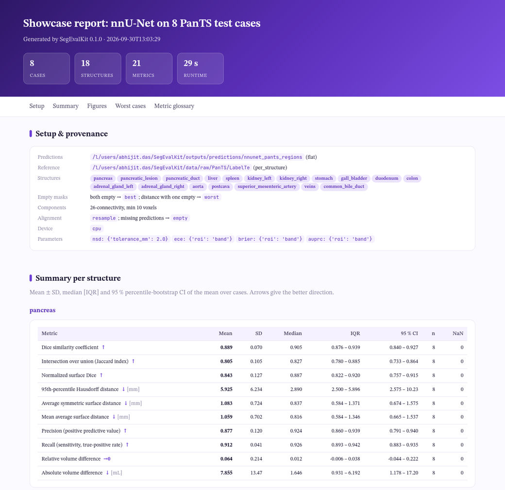

# HTML report

One self-contained HTML file (figures embedded, no server) with light and dark themes.

!!! tip "Open the sample report"
    [**nnU-Net on 8 PanTS test cases**](../assets/showcase/report_nnunet.html){ target="_blank" } is a real report,
    built by `build_report` from the showcase evaluation (18 structures, 21 metrics). Eight cases
    illustrate the report; they are not a benchmark.

<figure class="sk-fig sk-fig--md" markdown>
[](../assets/showcase/report_nnunet.html){ target="_blank" }
<figcaption>The top of the sample report: run statistics, setup and provenance, and the per-structure summary.</figcaption>
</figure>

=== "CLI"

    ```console
    $ segevalkit report eval/ --images imagesTs/ --gallery-metric dice --window abdomen
    ```

=== "Python"

    ```python
    from segevalkit.report import build_report
    build_report(res, "eval/report.html", image_source="imagesTs/",
                 gallery_metric="nsd", gallery_k=3)
    ```

| Section | Contents |
|---|---|
| Setup and provenance | prediction and reference paths and layouts, structures, empty-mask policy, connectivity, alignment, device, metric parameters, warnings for missing or failed cases |
| Summary per structure | mean ± SD, median [IQR], 95 % CI, *n* and NaN count per metric, with direction arrow and unit |
| Figures | raincloud distributions, metric vs size, failure quadrants (Dice vs HD95), volume agreement, metric correlation, lesion detection by size |
| Worst cases | tri-planar error overlays of the *k* worst cases per structure for the chosen metric |
| Metric glossary | definition, equation, range, direction, unit and reference for every reported metric |
