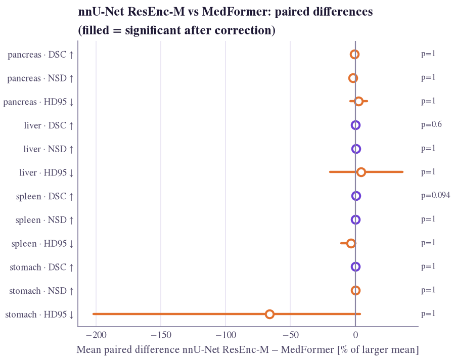
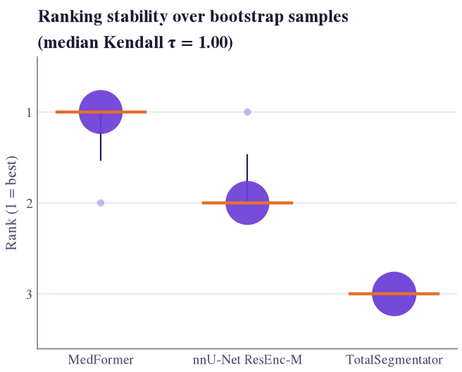

# Statistics & ranking

A mean Dice without spread, confidence interval and a paired test says little, and rankings on few cases are
fragile (Maier-Hein et al. 2018, *Nat Commun* 9:5217; Wiesenfarth et al. 2021, *Sci Rep* 11:2369).
`segevalkit.stats` implements the analyses these papers recommend.

## Summaries with confidence intervals

```python
res.summary()                    # every (label, metric)
from segevalkit.stats import summarize, bootstrap_ci
summarize(res.per_case(), by=("label", "metric"), ci=0.95, n_boot=2000)
bootstrap_ci(values, stat=np.median)
```

Columns: `n` (non-NaN cases), `n_nan`, `mean`, `std`, `median`, `q1`, `q3`, `min`, `max`, and the percentile-bootstrap
CI of the mean (`ci_low`, `ci_high`). NaNs are **counted, not hidden**.

!!! warning "Aggregate per structure"
    Liver 0.95 and a small lesion 0.40 do not average to a meaningful 0.675. Report per structure; if one number
    is needed, state how it was formed.

## Paired comparison of two methods

```python
from segevalkit.stats import compare
df = compare(res_a, res_b, metrics=["dice", "nsd", "hd95"],
             test="wilcoxon", correction="holm")
```

| Column | Meaning |
|---|---|
| `n` | common cases with both values defined |
| `mean_a`, `mean_b`, `mean_diff` | means and the mean paired difference *a − b* |
| `diff_ci_low`, `diff_ci_high` | bootstrap 95 % CI of the mean difference |
| `frac_a_better` | fraction of cases where *a* is better, **direction-aware** (lower HD95 is better) |
| `effect_rank_biserial` | matched-pairs rank-biserial correlation in [−1, 1], positive when *a* is better |
| `p_value`, `p_adjusted`, `significant` | raw and corrected p-values; significance at 0.05 after correction |

* `test`: `wilcoxon` (default, signed-rank), `ttest` (paired t) or `permutation` (sign-flip on the mean difference).
* `correction`: `holm` (family-wise, default), `bh` (false discovery rate) or `none`. The family is every
  (label, metric) pair in the call.

<figure class="sk-fig sk-fig--plot" markdown>
[](../assets/showcase/comparison_forest.png)
<figcaption>Real output of <code>compare</code> drawn with <a href="../plots/#comparing-methods"><code>comparison_forest</code></a>:
nnU-Net − MedFormer on 8 PanTS test CTs (an illustration, not a benchmark). Every marker is hollow: after Holm
correction over these 12 tests no difference is significant. Pancreas Dice reads p = 1 here but 0.445 when the
three pancreas tests form the family alone (<a href="../../getting-started/quickstart/">quickstart</a>): the family matters.</figcaption>
</figure>

## Ranking

```python
from segevalkit.stats import rank_methods, ranking_stability
results = {"nnU-Net": r1, "MedFormer": r2, "TotalSegmentator": r3}
rank_methods(results, "dice", label="pancreas", scheme="aggregate-then-rank")
rank_methods(results, "dice", label="pancreas", scheme="rank-then-aggregate")
stab = ranking_stability(results, "dice", label="pancreas", n_boot=1000)
```

* **Aggregate-then-rank** ranks the per-method mean (or median, `agg="median"`).
* **Rank-then-aggregate** ranks within each case, then averages; robust to a few catastrophic cases. A method
  missing a case ranks last there.

`ranking_stability` bootstraps the cases, re-ranks, and returns the rank distribution per method and Kendall's τ
to the full-data ranking ([blob plot](plots.md#ranking-stability)). A median τ well below 1 means the ranking
depends on which cases were in the test set.

<figure class="sk-fig sk-fig--square" markdown>
[](../assets/showcase/ranking_stability.png)
<figcaption>Pancreas Dice on 8 PanTS test CTs, 300 bootstrap samples. The full-data ranking is MedFormer (0.894),
nnU-Net (0.889), TotalSegmentator (0.863); the top two swap in some samples.</figcaption>
</figure>

## Volume agreement

```python
from segevalkit.stats import bland_altman, icc
w = res.wide(); w = w[w.label == "liver"]
bland_altman(w.pred_volume_ml, w.ref_volume_ml)     # bias, SD, 95 % limits of agreement
icc(w.pred_volume_ml, w.ref_volume_ml, kind="ICC(2,1)")
```

`ICC(2,1)` is absolute agreement (bias lowers it); `ICC(3,1)` is consistency (bias ignored). For volumetry, report
the bias with its limits of agreement and ICC(2,1).

## Size stratification

```python
from segevalkit.stats import stratify
stratify(res, "dice", by="ref_volume_ml", q=4, label="pancreatic_lesion")
stratify(res, "dice", bins=[0, 1, 5, 20, 1e9], label="pancreatic_lesion")
```

Reveals size dependence, e.g. Dice collapsing on small lesions under constant-thickness boundary errors
(Reinke et al. 2024).

## Presence detection

When references can be empty (tumour-free patients), segmentation metrics only describe patients with the
structure. Ask the patient-level question separately:

```python
from segevalkit.stats import presence_detection
r = presence_detection(res, "pancreatic_lesion", score="pred_volume_ml",
                       target_specificity=0.9)
r["auc"], r["sensitivity"], r["specificity"], r["threshold"]
```

A case is positive if its reference contains the structure (volume > `min_ref_ml`), and called positive if
`score` exceeds a threshold. The operating point is the lowest threshold reaching `target_specificity`; the result
also holds `n_pos`, `n_neg` and the ROC arrays. This is the PanTS patient-wise protocol.

### Localized presence

A patient flagged as positive may have been flagged for a false blob somewhere else. `localized_presence` reports
the plain patient-level sensitivity next to a *localized* one, which also requires at least one predicted lesion to
overlap a reference lesion, and the lesion-level sensitivity at the same threshold:

```python
from segevalkit.stats import localized_presence
r = localized_presence(res, "pancreatic_lesion", score="pred_volume_ml", target_specificity=0.9)
r["sensitivity"], r["sensitivity_localized"], r["lesion_sensitivity"], r["auc"], r["auc_localized"]
```

Specificity is the same for both; the gap between the two sensitivities is the fraction of positive patients found
only by accident. `score="lesion"` ranks patients by their most confident lesion instead of the predicted volume,
and a patient is then localized at a threshold only if a lesion touching the reference is still called.

## FROC and CPM

The free-response ROC curve plots lesion sensitivity against the mean number of false-positive lesions per scan
while the lesion confidence threshold is lowered, over all scans including lesion-free ones (Chakraborty & Berbaum
2004). The **Competition Performance Metric** is the mean sensitivity at 1/8, 1/4, 1/2, 1, 2, 4 and 8 false
positives per scan (LUNA16, Setio et al. 2017):

\[
\mathrm{CPM} = \frac{1}{7}\sum_{r\in\{\frac18,\frac14,\frac12,1,2,4,8\}} \mathrm{Sens}(r)
\]

```python
from segevalkit.stats import froc
f = froc(res, "pancreatic_lesion", n_boot=1000)
f["cpm"], f["cpm_ci"], f["sensitivity_at"], f["max_sensitivity"]
```

FROC needs a confidence per predicted lesion. The `Evaluator` stores it in the lesion table whenever detection
metrics run: the maximum probability inside the component when a probability source is given
(`evaluate(..., prob="probs/")`, `lesion_score="max"` or `"mean"`), otherwise the component volume in mL, recorded
in `score_type`. Sensitivity at each FP rate is read off the curve by linear interpolation; beyond the largest FP
rate the model reaches, its final sensitivity holds, so a CPM below the maximum sensitivity means the model reaches
it only with many false positives. The interval resamples cases.

## Precision-recall curves

```python
from segevalkit.stats import lesion_pr, patient_pr
lesion_pr(res, "pancreatic_lesion")["ap"]                     # lesions ranked by confidence
patient_pr(res, "pancreatic_lesion", score="pred_volume_ml")  # patients ranked by predicted volume
patient_pr(res, "pancreatic_lesion", localized=True)          # mislocalized calls count as false positives
```

Lesion-level precision counts detected reference lesions as true positives,
\(TP_{\mathrm{les}}/(TP_{\mathrm{les}}+FP_{\mathrm{les}})\), as [lesion F1](../metrics/detection.md#lesion_f1) does;
AP is the all-point interpolated area. Unlike ROC, PR curves depend on prevalence: at patient level the chance line
is the fraction of positive patients (`prevalence`), not 0.5.

