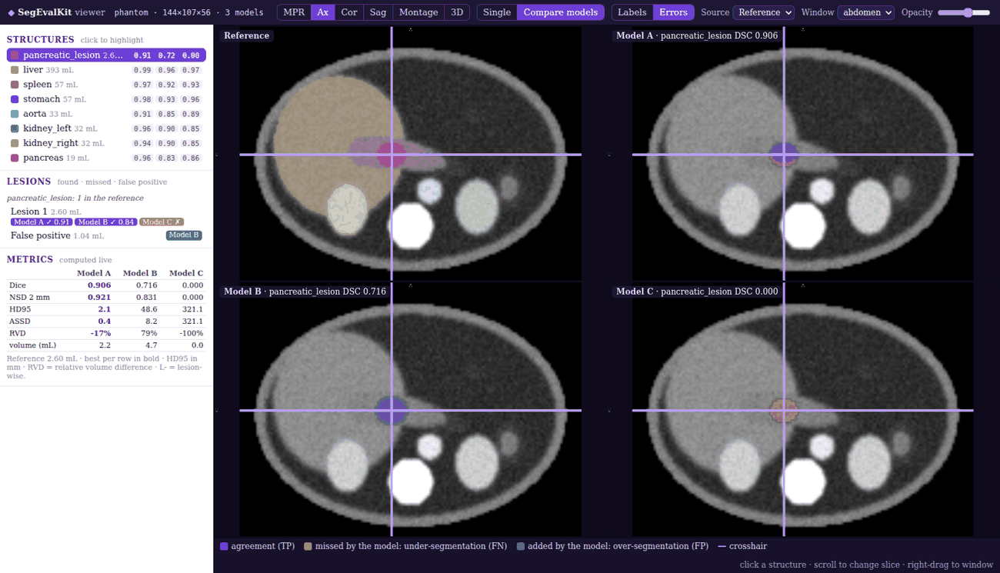
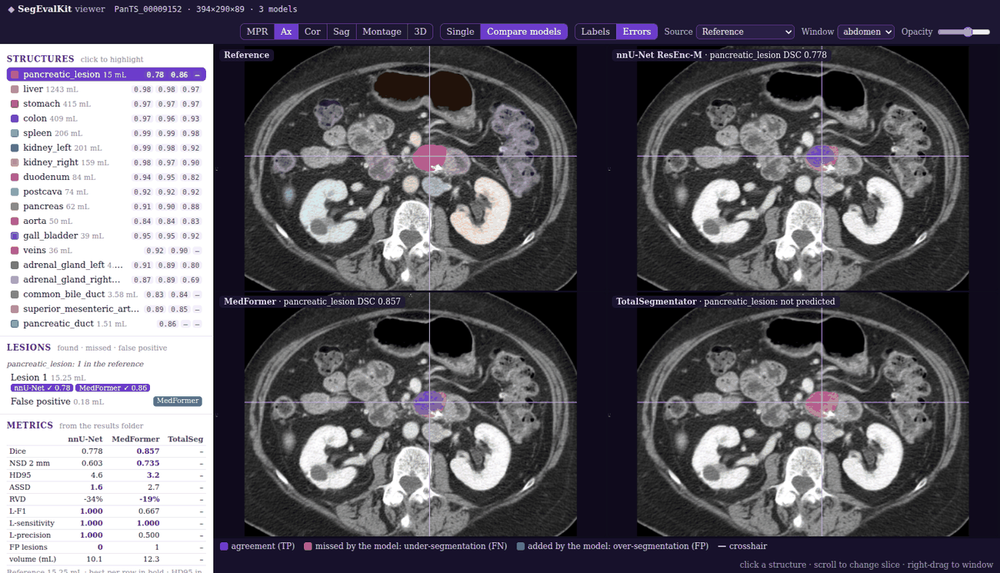
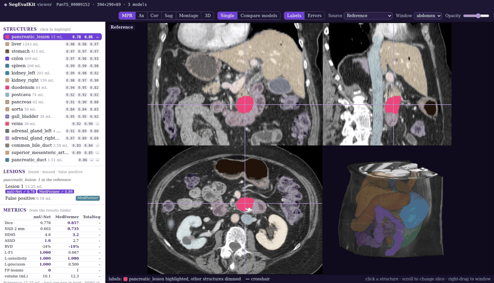
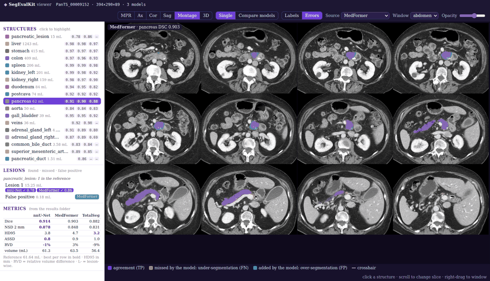
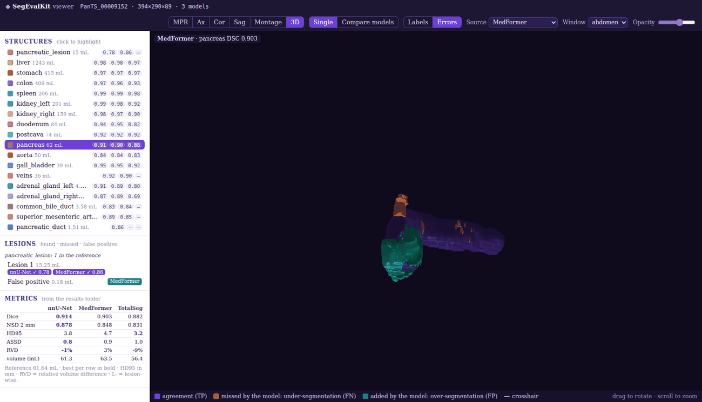

# Interactive viewer

`segevalkit view` opens a case in the browser: the image, the reference and any number of model predictions,
in axial, coronal, sagittal, montage and rotatable 3D views. Click a structure or lesion to highlight it, switch to
error colouring against the reference, or put every model side by side, synchronised.

!!! tip "Try it now: no data needed"
    [**Open the live demo**](../assets/viewer/demo_phantom.html){ target="_blank" }: a synthetic abdominal phantom
    with three synthetic models, in one self-contained page (4.5 MB). Or run it locally:

    ```console
    $ pip install "segevalkit[all] @ git+https://github.com/aj-das-research/SegEvalKit.git@v0.1.0"
    $ segevalkit view --demo
    ```

<figure class="sk-fig sk-fig--wide" markdown>
[](../assets/viewer/demo_phantom.html){ target="_blank" }
<figcaption>The demo in "Compare models": Model A finds the lesion, Model B over-segments it and adds a false-positive lesion in the liver, Model C misses it (orange).</figcaption>
</figure>

## Your own data

=== "One model"

    ```console
    $ segevalkit view --image ct.nii.gz --ref labels.nii.gz --pred nnunet=pred.nii.gz \
          --labels liver=1,tumour=2
    ```

=== "Several models"

    ```console
    $ segevalkit view --image PanTS/ImageTe --ref PanTS/LabelTe --case PanTS_00009152 \
          --labels "liver,spleen,pancreatic_lesion" \
          --pred nnU-Net=preds/nnunet --pred MedFormer=preds/medformer \
          --pred-labels nnU-Net=nnunet_labels.yaml --results nnU-Net=eval/nnunet
    ```

=== "Config file"

    ```yaml title="view.yaml"
    image: PanTS/ImageTe
    ref: PanTS/LabelTe
    case: PanTS_00009152
    labels:
      pancreas: {ref_file: "pancreas.nii.gz+pancreatic_lesion.nii.gz"}
      pancreatic_lesion: {}
      liver: {}
    preds:
      nnU-Net: {path: preds/nnunet, labels: {pancreas: [17, 18, 19, 20, 21, 28], pancreatic_lesion: 28, liver: 14},
                results: eval/nnunet}
      MedFormer: preds/medformer
    ```

    ```console
    $ segevalkit view --config view.yaml
    ```

=== "Python"

    ```python
    from segevalkit.app import ViewerSession, serve, export_html

    s = ViewerSession("ct.nii.gz", ref="labels/", preds={"nnU-Net": "pred.nii.gz"},
                      labels={"liver": 1, "tumour": 2}, results={"nnU-Net": "eval/"})
    serve(s)                         # http://localhost:8765
    export_html(s, "case.html")      # one self-contained file
    ```

Inputs are resolved exactly as in [`evaluate`](../getting-started/data-format.md): a side is a multi-label map
(structures are id sets), a folder of per-structure masks (`"a.nii.gz+b.nii.gz"` is a union), or a dataset folder
plus `--case`. `--pred-labels` gives a model its own label spec when its output convention differs (nnU-Net ids,
TotalSegmentator names). With `--results`, the metric panel shows the values stored by `evaluate` for this case;
otherwise Dice, NSD (2 mm), HD95, ASSD and RVD are computed live.

## What you see

=== "Compare models"

    <figure class="sk-fig sk-fig--wide" markdown>
    [](../assets/showcase/viewer_compare.png)
    <figcaption>PanTS_00009152: reference and three official models, synchronised; the pancreatic lesion in error colours. TotalSegmentator has no lesion class ("not predicted").</figcaption>
    </figure>

=== "Multiplanar"

    <figure class="sk-fig sk-fig--wide" markdown>
    [](../assets/showcase/viewer_mpr.png)
    <figcaption>Axial, coronal, sagittal and 3D render; the selected lesion is bright, the other structures dimmed.</figcaption>
    </figure>

=== "Montage"

    <figure class="sk-fig sk-fig--wide" markdown>
    [](../assets/showcase/viewer_montage.png)
    <figcaption>Twelve axial slices spanning the selected structure (pancreas, MedFormer errors).</figcaption>
    </figure>

=== "3D"

    <figure class="sk-fig sk-fig--wide" markdown>
    [](../assets/showcase/viewer_3d.png)
    <figcaption>Surfaces of MedFormer's pancreas errors: agreement (violet, translucent), missed (orange), added (teal). Drag to rotate.</figcaption>
    </figure>

| Control | Does |
|---|---|
| **MPR · Ax · Cor · Sag · Montage · 3D** | layout of the views (keys `P` `A` `C` `S` `M` `R`) |
| **Single · Compare models** | one source, or the reference and every model side by side, synchronised |
| **Labels · Errors** | structure colours, or TP / FN / FP of the selected structure against the reference (key `E`) |
| Structure list | click to highlight and jump to the structure; chips are each model's Dice |
| Lesion list | every reference lesion (found ✓ with its Dice, or missed ✗ per model) and every false-positive lesion; click to jump |
| Window · Opacity | CT window preset and overlay opacity; right-drag in a slice also windows |

| Colour (errors) | Meaning |
|---|---|
| violet | agreement (true positive) |
| orange | reference tissue the model **missed**: under-segmentation (false negative) |
| teal | tissue the model **added**: over-segmentation (false positive) |

## Share and remote use

- **One file.** `segevalkit view ... --export case.html` writes a self-contained page (viewer, volumes, surfaces)
  that opens without Python or network. Exports are cropped to the structures (`--crop`, mm) and strided
  (`--max-dim`, voxels per axis) to stay small; the demo page is 4.5 MB, a full PanTS case about 11 MB.
- **On a cluster.** Run the viewer on the compute node and forward the port from your laptop:
  `ssh -L 8765:<node>:8765 <login-host>`, then open <http://localhost:8765/>. The command prints this line.
- **Requirements.** Any browser with WebGL 2 (Chrome, Edge, Firefox, Safari). The server uses only the Python
  standard library.

!!! note "Geometry"
    Masks with the same array shape as the image are shown in voxel correspondence, since label headers are not always
    trustworthy ([pitfall](../guide/pitfalls.md#header-mismatch)); masks on another grid are resampled onto the
    image grid (nearest neighbour).

<small>Rendering by [NiiVue](https://github.com/niivue/niivue) 0.69 (BSD-2-Clause), vendored with its licence.
Screenshots show PanTS test case PanTS_00009152 (Li et al., NeurIPS 2025; © The Johns Hopkins University,
[CC BY-NC-ND 4.0](https://creativecommons.org/licenses/by-nc-nd/4.0/)) with predictions of the official nnU-Net,
MedFormer and TotalSegmentator checkpoints. The live demo uses a synthetic phantom, no patient data.</small>
