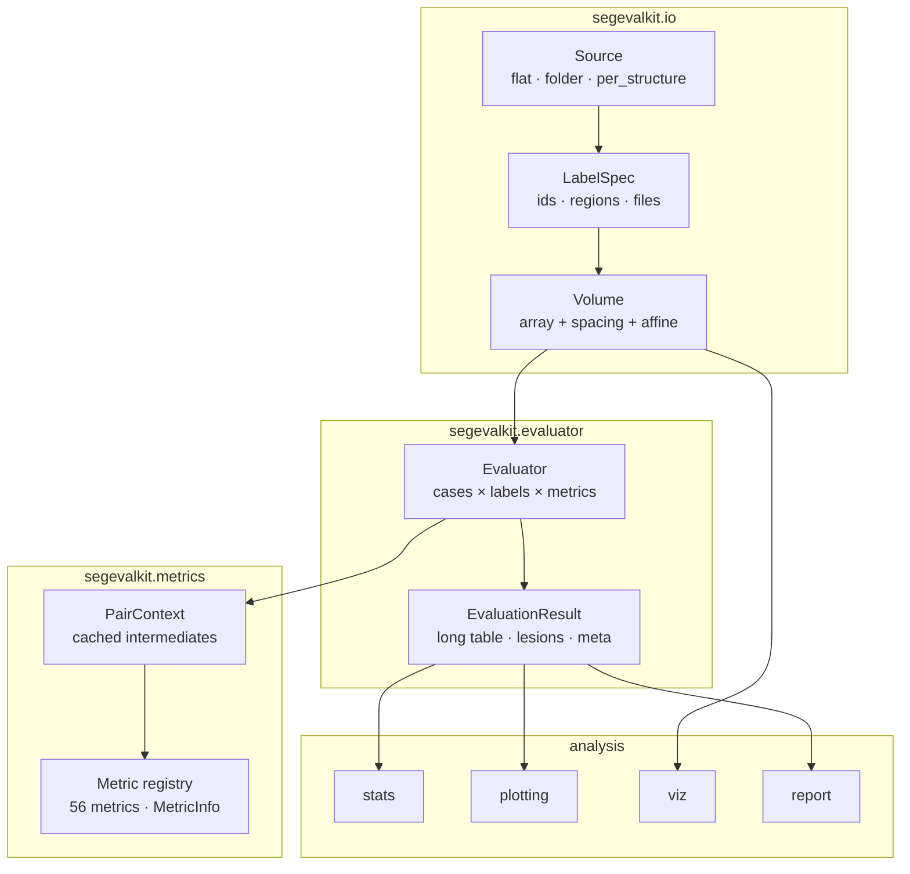

# Architecture

## Layers

| Layer | Package | Responsibility | Depends on |
|---|---|---|---|
| I/O | `segevalkit.io` | files → arrays with geometry; label specs; case discovery and pairing | nibabel (SimpleITK optional) |
| Metrics | `segevalkit.metrics` | one binary pair → numbers; registry of metric metadata | NumPy, SciPy, scikit-image (torch optional) |
| Engine | `segevalkit.evaluator`, `segevalkit.results` | datasets × labels × metrics → a tidy, persisted result | I/O, metrics |
| Analysis | `stats`, `plotting`, `viz`, `report` | results → conclusions, figures, reports | pandas, matplotlib, jinja2 |
| Guidance | `guide`, `datasets`, `synthetic` | which metrics, which protocol, how metrics behave | metrics |
| Interface | `cli`, `_console` | the `segevalkit` command and its terminal UI | everything above, rich |

Lower layers never import higher ones: metrics know nothing about files and I/O knows nothing about metrics, so
`compute_metrics` works on in-memory arrays from any source.

## The life of one evaluation

| Step | What happens |
|---|---|
| 1. Discovery | `Source` detects the folder layout and indexes case ids; `discover_cases` pairs them. The **reference defines the case list**. |
| 2. Loading | `Source.load_mask` returns a boolean mask and its `Volume` geometry per case and label; multi-label files are loaded once per case. |
| 3. Geometry | `check_alignment` compares shape, spacing and affine; the `alignment` policy fails the case, resamples the prediction or ignores header differences. |
| 4. Context | A lazy `PairContext(pred, ref, spacing, prob)` is created. |
| 5. Metrics | Each metric is called with the context; the first one needing an intermediate (e.g. surface distances) computes it, later ones reuse it. |
| 6. Rows | Each value becomes a row `(case_id, label, metric, value)`, plus descriptive `_` flags and optional lesion rows. |
| 7. Result | Rows from all workers form an `EvaluationResult` with a provenance `meta` dictionary, saved as the [standard results folder](../getting-started/data-format.md#the-results-folder). |

## The computation context

`PairContext` caches each expensive intermediate as a property:

| Property | Computed from | Used by |
|---|---|---|
| `counts` | voxel-wise AND / counts (CPU or GPU) | every overlap, volume and agreement metric |
| `pred_surface`, `ref_surface` | erosion on the padded union bounding box | distance metrics |
| `surface_distances` | EDT (CPU) or chunked nearest-neighbour search (GPU) | HD, HD95, ASSD, MASD, NSD |
| `pred_components`, `ref_components` | connected-component labelling (cc3d or SciPy) | detection metrics |
| `pred_skeleton`, `ref_skeleton` | 3D thinning with a symmetric-object fallback | clDice |
| `memo(key, fn)` | anything a metric plug-in needs | e.g. Betti numbers, instance matching, ROI bands |

Geometry is computed on the padded union bounding box (grown by one voxel), so a small structure in a large CT costs
only its crop, and voxels on the image border still count as surface.

## Design rules

1. **Every number has a written definition**: the equation in the docstring; range, direction, unit and reference in
   the registry. The docs render both.
2. **Conventions are explicit**: empty masks, percentile mode, connectivity, tolerances and alignment are arguments,
   stored in `meta.json` and pinned by conformance tests.
3. **Undefined is NaN, not 0** (e.g. precision of an empty prediction), and NaNs are counted in summaries.
4. **Backends compute the same thing**: the GPU path is an acceleration, never a different definition.
5. **Plain outputs**: CSV and JSON, so results outlive the library.
6. **No hidden state**: no global configuration; everything flows through arguments.
