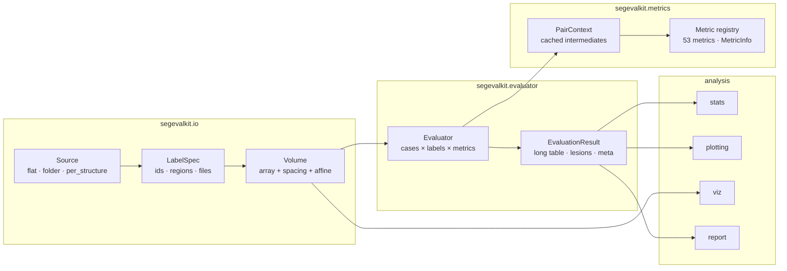

# Architecture

## Layers

| Layer | Package | Responsibility | Depends on |
|---|---|---|---|
| I/O | `segevalkit.io` | files → arrays with geometry; label specs; case discovery and pairing | nibabel (SimpleITK optional) |
| Metrics | `segevalkit.metrics` | one binary pair → numbers; registry of metric metadata | NumPy, SciPy, scikit-image (torch optional) |
| Engine | `segevalkit.evaluator`, `segevalkit.results` | datasets × labels × metrics → a tidy, persisted result | I/O, metrics |
| Analysis | `stats`, `plotting`, `viz`, `report` | results → conclusions, figures, reports | pandas, matplotlib, jinja2 |
| Guidance | `guide`, `datasets`, `synthetic` | which metrics, which protocol, how metrics behave | metrics |
| Interface | `cli`, `_console` | the `segevalkit` command and its terminal UI | everything above, rich |

Lower layers never import higher ones. The metric layer knows nothing about files; the I/O layer knows nothing about
metrics. This is what lets `compute_metrics` work on in-memory arrays from any source.

## The life of one evaluation

1. **Discovery.** `Source` detects the layout of the prediction and reference folders and builds an index of case
   ids. `discover_cases` pairs them; the **reference defines the case list**.
2. **Loading.** Per case and label, `Source.load_mask` returns a boolean mask and its `Volume` geometry. For
   multi-label files the volume is loaded once per case and cached.
3. **Geometry.** `check_alignment` compares shape, spacing and affine; the `alignment` policy decides between
   failing the case, resampling the prediction or ignoring header differences.
4. **Context.** A `PairContext(pred, ref, spacing, prob)` is created. Nothing is computed yet.
5. **Metrics.** Each requested metric is called with the context. The first metric that needs, say, surface
   distances triggers their computation; every later metric reuses them.
6. **Rows.** Each value becomes a row `(case_id, label, metric, value)`, plus descriptive `_` flags and optional
   lesion rows.
7. **Result.** Rows from all workers become an `EvaluationResult` with a provenance `meta` dictionary, saved as the
   [standard results folder](../getting-started/data-format.md#the-results-folder).

## The computation context

`PairContext` is the performance and correctness core. Each expensive intermediate is a cached property:

| Property | Computed from | Used by |
|---|---|---|
| `counts` | voxel-wise AND / counts (CPU or GPU) | every overlap, volume and agreement metric |
| `pred_surface`, `ref_surface` | erosion on the padded union bounding box | distance metrics |
| `surface_distances` | EDT (CPU) or chunked nearest-neighbour search (GPU) | HD, HD95, ASSD, MASD, NSD |
| `pred_components`, `ref_components` | connected-component labelling (cc3d or SciPy) | detection metrics |
| `pred_skeleton`, `ref_skeleton` | 3D thinning with a symmetric-object fallback | clDice |
| `memo(key, fn)` | anything a metric plug-in needs | e.g. Betti numbers, instance matching, ROI bands |

All geometry is computed on the union bounding box grown by one voxel and padded, so a small structure in a large
CT costs as much as its crop, and voxels on the true image border still count as surface.

## Design rules

1. **Every number has a written definition.** Each metric's docstring holds its equation; its registry entry holds
   range, direction, unit and reference; the docs render both.
2. **Conventions are explicit and recorded.** Empty masks, percentile mode, connectivity, tolerances and alignment
   are arguments, stored in `meta.json`, and pinned by conformance tests.
3. **Undefined is NaN, not 0.** A value that does not exist (precision of an empty prediction) is reported as NaN
   and counted in summaries.
4. **Backends compute the same thing.** The GPU path is an acceleration, never a different definition.
5. **Plain outputs.** Results are CSV and JSON so they outlive the library.
6. **No hidden state.** No global configuration; everything flows through arguments.
