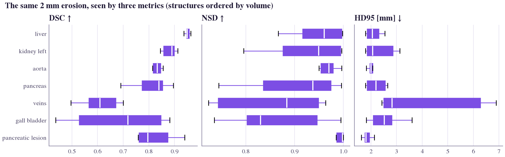
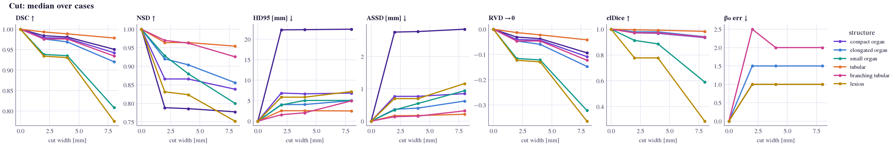
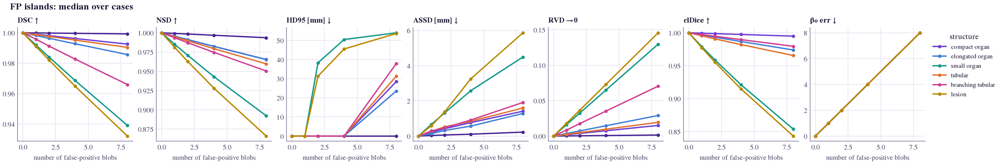
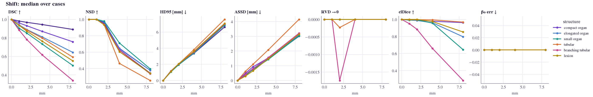
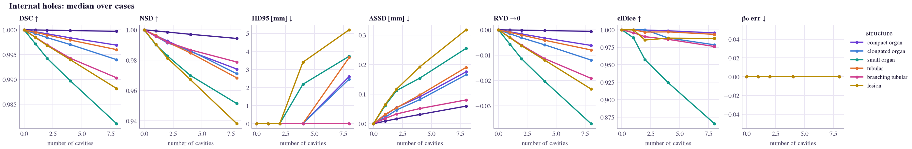
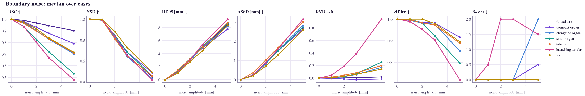

# Sensitivity study: what does each metric see?

Metric pitfalls are usually illustrated with toy shapes. Here they are measured on **real CT anatomy**: reference
masks from the PanTS test set, disturbed by errors of known type and physical size, scored with every metric.
The question for each (metric, error) pair is simple: *when the error grows, does the metric notice?*

## Design

**Structures.** Seven PanTS structures chosen to span size and shape: liver (large organ), left kidney (compact
organ), pancreas (elongated organ), gallbladder (small organ), aorta (tubular), veins (branching tubular) and
pancreatic lesion (small, irregular). Ten randomly chosen test cases per structure (lesions: ten cases that
contain one), at native resolution and spacing, cropped with an 80 mm margin.

**Errors.** Eight perturbations from `segevalkit.synthetic`, each at 4–5 magnitudes in physical units:

| Perturbation | What it simulates | Magnitudes |
|---|---|---|
| Erosion / dilation | uniform under- / over-segmentation of the boundary | 0, 1, 2, 3, 5 mm |
| Boundary noise | smooth random in-and-out boundary jitter at constant volume | 0, 1, 2, 3, 5 mm |
| Shift | registration-like rigid displacement | 0, 1, 2, 4, 8 mm |
| FP islands | spurious 4 mm blobs within 60 mm of the structure | 0, 1, 2, 4, 8 blobs |
| Missing slab | part of the structure missed | 0, 5, 10, 20, 40 % |
| Internal holes | cavities of 3 mm radius inside the structure | 0, 1, 2, 4, 8 holes |
| Cut | a planar cut that breaks connectivity with almost no volume change | 0, 2, 4, 8 mm |

**Does the metric notice?** For each error type at a representative size (2 mm erosion, dilation and boundary
noise; 4 mm shift and cut; 2 islands or holes; 10 % missing), the fraction of structure-cases in which the metric
changes by at least a meaningful amount: 0.02 for bounded scores, 1 mm for distances, 1 for counts. Topology
metrics were computed for the tubular structures, the lesion and three organs as controls.

```console
$ python benchmarks/metric_sensitivity.py --ref-root data/raw/PanTS/LabelTe \
    --out outputs/sensitivity --n-cases 10
$ python benchmarks/plot_sensitivity.py --csv outputs/sensitivity/sensitivity.csv \
    --out docs/assets/figures
```

## Results

<figure class="sk-fig sk-fig--wide" markdown>

<figcaption>Fraction of real PanTS structures (7 structures × 10 cases) in which each metric changes meaningfully
under each error. Dark = the metric notices; light = it is blind to that error.</figcaption>
</figure>

Percentages are the fraction of the 70 structure-cases in which the metric changed meaningfully (60 for the topology metrics, computed on six of the seven structures).

| Error | Reliably noticed by | Largely missed by | Median values |
|---|---|---|---|
| Boundary erosion (2 mm) | Dice, IoU, HD, HD95, BIoU, RVD (100 %) | Betti errors (18–33 %), clDice (48 %) | see size bias below |
| Rigid shift (4 mm) | Dice, NSD, HD95, centroid distance (100 %) | **RVD (0 %)**: the volume is unchanged | Dice 0.80, HD95 3.6 mm, RVD 0.00 |
| 2 false-positive islands | **HD, Betti‑0 error, lesion F1 (100 %)** | **Dice (11 %), HD95 (17 %)**, NSD (23 %) | Dice 0.996, HD 54.7 mm, HD95 0.0 mm, lesion F1 0.50 |
| 2 internal holes | **Betti‑2 error (88 %)**, HD (93 %) | Dice (6 %), HD95 (11 %), ASSD (0 %) | Dice 0.998, Betti‑2 error 2 |
| 4 mm cut | **Betti‑0 error (98 %)**, NSD (99 %), HD (100 %) | ASSD (26 %); clDice and Dice barely move on vessels | aorta / veins: Dice 0.985, clDice 0.99, Betti‑0 error 2 |

Three lessons stand out:

1. **Every metric is blind to something.** Only the HD row is dark everywhere, and HD pays for it: it
   cannot tell a distant island from a thick boundary error, and a single outlier sets it.
2. **Robust summaries hide the errors they are robust to.** HD95 and Dice almost entirely ignore two spurious
   islands (median HD95 = 0.0 mm), which is exactly the error a lesion-detection metric exists to catch.
3. **Topology needs its own metrics.** Holes and cuts leave overlap and distance metrics almost unchanged; only
   the Betti errors see them. clDice, designed for connectivity, barely reacts to a short cut.

### Size bias

<figure class="sk-fig sk-fig--wide" markdown>

<figcaption>The same 2 mm erosion applied to every structure. Dice falls from 0.95 on the liver to 0.72 on the
gallbladder and 0.61 on the veins; the median HD95 stays between 1.8 and 2.8 mm, close to the true 2 mm.</figcaption>
</figure>

Dice punishes small and thin structures for the same physical error, so Dice values are not comparable across
structures of different size ([pitfall](pitfalls.md#size-bias)); a boundary-distance metric states the error in
millimetres.

### Error curves

<div class="sk-curves" markdown>

=== "Cut"
    [](../assets/figures/sensitivity_cut.png)
=== "FP islands"
    [](../assets/figures/sensitivity_islands.png)
=== "Erosion"
    [](../assets/figures/sensitivity_erode.png)
=== "Shift"
    [](../assets/figures/sensitivity_shift.png)
=== "Holes"
    [](../assets/figures/sensitivity_holes.png)
=== "Boundary noise"
    [](../assets/figures/sensitivity_boundary_noise.png)

</div>

Median metric value against error size, one line per structure type; select a figure to open it at full
resolution. The underlying numbers are in
`docs/assets/figures/sensitivity_summary.csv`.
