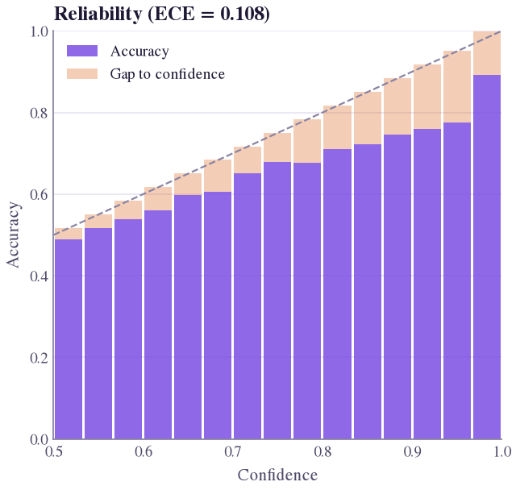

# Probabilistic & calibration metrics

With a foreground probability map `prob` (floats in \([0, 1]\), same shape as the masks) two more questions open
up: **discrimination** ([AUROC](#auroc), [AUPRC](#auprc)) and **calibration** ([ECE](#ece), [Brier](#brier),
[NLL](#nll)). [Soft Dice](#soft_dice) sits in between. Without `prob`, these metrics are skipped, not NaN. None
describes mask geometry (Mehrtash et al. 2020).

<figure class="sk-fig sk-fig--sm" markdown>
[](../assets/showcase/reliability_medformer_lesion.png)
<figcaption>MedFormer lesion probabilities in a 10 mm band on 8 PanTS test CTs (an illustration, not a benchmark): over-confident in every bin, ECE = 0.108. <a href="../../analysis/plots/#calibration"><code>reliability_diagram</code></a>.</figcaption>
</figure>

## At a glance

| Metric | Measures | Proper scoring rule | ROI | Background-dominated with `roi="all"` |
|---|---|:-:|:-:|:-:|
| [Soft Dice](#soft_dice) | soft overlap | no | whole image | no (ignores TN) |
| [AUROC](#auroc) | discrimination | no | yes | yes |
| [AUPRC](#auprc) | discrimination under imbalance | no | yes | less |
| [Brier](#brier) | calibration + sharpness | yes | yes | yes |
| [NLL](#nll) | calibration + sharpness | yes | yes | yes |
| [ECE](#ece) | calibration | no | yes | yes |

## Notation and region of interest

\(p_i\) is the predicted foreground probability of voxel \(i\), \(g_i \in \{0, 1\}\) its label, \(N\) the voxels
in the region. Calibration uses the top-label view (Guo et al. 2017): label \(\hat y_i = [p_i \ge 0.5]\),
confidence \(c_i = \max(p_i, 1-p_i) \in [0.5, 1]\), correct if \(\hat y_i = g_i\). `Evaluator.evaluate` reads
per-structure maps from a folder (`prob=`).

3D volumes are mostly easy background with \(p \approx 0\), so all metrics except soft Dice take `roi`.
`roi="all"` (default) is the whole image, the literal definition. `roi="band"` is the union of reference and
predicted (\(p \ge 0.5\)) foreground grown by `margin_mm` (Euclidean, with spacing), where the model is actually
uncertain (Mehrtash et al. 2020); an empty band gives NaN.

## Metrics

<div class="sek-metric" markdown>

### Soft Dice (sDSC) {#soft_dice}

<div class="sek-meta"><span class="sek-chip">soft_dice</span><span class="sek-chip">[0, 1]</span><span class="sek-chip teal">↑ higher is better</span></div>

\[
\mathrm{sDSC} = \frac{2\sum_i p_i g_i}{\sum_i p_i + \sum_i g_i}
\]

**In words** Dice with probabilities instead of a mask: confident correct voxels count fully, hesitant ones partially.

**Use when** Comparing models trained with a soft Dice loss, or checking how much confidence spreads outside the object.

**Watch out** Not a calibration measure: a perfectly calibrated \(p = 0.9\) interior scores below 1, and diffuse background mass lowers it.

??? info "Details: empty masks, parameters, reference"
    **Region.** Summed over the whole image; no `roi`.

    **Empty masks.** \(\sum_i p_i + \sum_i g_i = 0\) (empty reference, all-zero map): 1 (`"best"`) or NaN.

    **Reference.** Milletari F, Navab N, Ahmadi SA. V-Net. *3DV 2016*, 565–571. [doi:10.1109/3DV.2016.79](https://doi.org/10.1109/3DV.2016.79)

</div>

<div class="sek-metric" markdown>

### Area under the ROC curve (AUROC) {#auroc}

<div class="sek-meta"><span class="sek-chip">auroc</span><span class="sek-chip">[0, 1]</span><span class="sek-chip teal">↑ higher is better</span></div>

\[
\mathrm{AUROC} = \int_0^1 \mathrm{TPR}\; d\,\mathrm{FPR} = P\big(p_i > p_j \mid g_i = 1,\, g_j = 0\big)
\]

**In words** The probability that a random foreground voxel scores higher than a random background voxel.

**Use when** You need threshold-free discrimination, preferably inside `roi="band"`.

**Watch out** With `roi="all"` it is near 1 for almost any model; prefer [AUPRC](#auprc), and it ignores calibration entirely.

??? info "Details: empty masks, parameters, reference"
    **Computation.** Mann–Whitney statistic on a 1024-bin score histogram (ties within a bin count one half): exact up to bin width, \(O(N)\). Invariant to any monotone rescaling of \(p\).

    **Empty masks.** NaN whenever the region has no foreground or no background voxel (not governed by the `EmptyPolicy`).

    **Parameters.** `roi="all"`, `margin_mm=10.0`.

    **Reference.** Hanley JA, McNeil BJ. *Radiology* 143(1), 29–36 (1982). [doi:10.1148/radiology.143.1.7063747](https://doi.org/10.1148/radiology.143.1.7063747)

</div>

<div class="sek-metric" markdown>

### Area under the precision-recall curve (AP; average precision) {#auprc}

<div class="sek-meta"><span class="sek-chip">auprc</span><span class="sek-chip">[0, 1]</span><span class="sek-chip teal">↑ higher is better</span></div>

\[
\mathrm{AP} = \sum_k (R_k - R_{k-1})\,P_k
\]

**In words** Average precision over all thresholds: how well foreground voxels are ranked first as recall grows.

**Use when** Foreground is a small fraction of the region, as always in 3D; stays informative under heavy imbalance.

**Watch out** Its baseline is the foreground prevalence, not 0.5, so values do not compare across structures or regions.

??? info "Details: empty masks, parameters, reference"
    **Computation.** Descending thresholds \(k\) are the 1024 histogram bin edges; \(P_k\), \(R_k\) are voxel precision and recall, \(R_0 = 0\). A discrimination measure, not calibration.

    **Empty masks.** NaN when the region has no reference foreground.

    **Parameters.** `roi="all"`, `margin_mm=10.0`.

    **Reference.** Saito T, Rehmsmeier M. *PLoS ONE* 10(3), e0118432 (2015). [doi:10.1371/journal.pone.0118432](https://doi.org/10.1371/journal.pone.0118432)

</div>

<div class="sek-metric" markdown>

### Brier score (BS) {#brier}

<div class="sek-meta"><span class="sek-chip">brier</span><span class="sek-chip">[0, 1]</span><span class="sek-chip teal">↓ lower is better</span></div>

\[
\mathrm{BS} = \frac1N\sum_{i=1}^{N} (p_i - g_i)^2
\]

**In words** The mean squared difference between predicted probability and the true 0/1 label.

**Use when** You want a proper scoring rule rewarding calibration and sharpness; the standard companion to ECE.

**Watch out** Diluted by background under `roi="all"` (0.011 whole image vs 0.057 in the band below); compare methods on one region.

??? info "Details: empty masks, parameters, reference"
    **Empty masks.** NaN when the region is empty (only possible with `roi="band"`).

    **Parameters.** `roi="all"`, `margin_mm=10.0`.

    **Reference.** Brier GW. *Monthly Weather Review* 78(1), 1–3 (1950). [doi:10.1175/1520-0493(1950)078<0001:VOFEIT>2.0.CO;2](https://doi.org/10.1175/1520-0493(1950)078%3C0001:VOFEIT%3E2.0.CO;2)

</div>

<div class="sek-metric" markdown>

### Negative log-likelihood (NLL) {#nll}

<div class="sek-meta"><span class="sek-chip">nll</span><span class="sek-chip">[0, ∞)</span><span class="sek-chip teal">↓ lower is better</span><span class="sek-chip orange">nats per voxel</span></div>

\[
\mathrm{NLL} = -\frac1N\sum_{i=1}^{N} \big[g_i\log p_i + (1-g_i)\log(1-p_i)\big]
\]

**In words** The average surprise of the true label under the predicted probabilities; confident mistakes are punished hard.

**Use when** Comparing calibration methods (temperature scaling, ensembling) with a proper scoring rule.

**Watch out** Dominated by a few confidently wrong voxels and, with `roi="all"`, by background; the clipping constant must match across tools.

??? info "Details: empty masks, parameters, reference"
    **Clipping.** \(p_i\) is clipped to \([10^{-7},\, 1-10^{-7}]\), so one voxel contributes at most about 16.1 nats.

    **Empty masks.** NaN when the region is empty.

    **Parameters.** `roi="all"`, `margin_mm=10.0`.

    **Reference.** Guo C, Pleiss G, Sun Y, Weinberger KQ. On calibration of modern neural networks. *ICML 2017*, PMLR 70, 1321–1330. [arXiv:1706.04599](https://arxiv.org/abs/1706.04599)

</div>

<div class="sek-metric" markdown>

### Expected calibration error (ECE) {#ece}

<div class="sek-meta"><span class="sek-chip">ece</span><span class="sek-chip">[0, 1]</span><span class="sek-chip teal">↓ lower is better</span></div>

\[
\mathrm{ECE} = \sum_{b=1}^{B}\frac{\lvert B_b\rvert}{N}\,\big\lvert\mathrm{acc}(B_b) - \mathrm{conf}(B_b)\big\rvert
\]

**In words** The voxel-weighted average gap between confidence and accuracy across confidence bins; 0 is perfectly calibrated.

**Use when** Probabilities will be read by people or drive decisions; always show the reliability diagram with it.

**Watch out** Whole-volume ECE looks excellent ([background dilution](../guide/pitfalls.md#calibration-background)); not a proper scoring rule, so pair with Brier or NLL.

??? info "Details: empty masks, parameters, reference"
    **Bins.** \(B\) equal-width bins of top-label confidence \(c_i \in [0.5, 1]\); \(\mathrm{conf}(B_b)\) is mean confidence, \(\mathrm{acc}(B_b)\) the fraction correct. The bin count changes the value. `segevalkit.metrics.calibration.reliability_curve(p, y, n_bins)` returns per-bin data.

    **Example.** 0.022 over the image vs 0.111 in a 5 mm band (below). A model always predicting the prevalence can be perfectly calibrated and useless.

    **Empty masks.** NaN when the region is empty.

    **Parameters.** `roi="all"`, `margin_mm=10.0`, `n_bins=15`.

    **Reference.** Naeini MP, Cooper GF, Hauskrecht M. *AAAI 2015*. [doi:10.1609/aaai.v29i1.9602](https://doi.org/10.1609/aaai.v29i1.9602). Guo et al. 2017, [arXiv:1706.04599](https://arxiv.org/abs/1706.04599). Mehrtash A et al. Confidence calibration and predictive uncertainty estimation for deep medical image segmentation. *IEEE TMI* 39(12), 3868–3878 (2020). [doi:10.1109/TMI.2020.3006437](https://doi.org/10.1109/TMI.2020.3006437)

</div>

## Code

The `calibration` set is `ece`, `brier`, `nll`, `auroc`, `auprc`, `soft_dice`. Here the thresholded mask is
correct except for an over-confident 2-voxel shell just outside the object:

```python
import numpy as np
from scipy import ndimage
from segevalkit.metrics import compute_metrics

ref = np.zeros((48, 48, 48), bool)
ref[16:32, 16:32, 16:32] = True
dist = ndimage.distance_transform_edt(~ref)
prob = np.full(ref.shape, 0.001, np.float32)   # confident, correct background
prob[ref] = 0.9                                # foreground
prob[(dist > 0) & (dist <= 2)] = 0.6           # over-confident shell
pred = prob >= 0.5

names = ["soft_dice", "auroc", "auprc", "brier", "nll", "ece"]
whole = compute_metrics(pred, ref, names, spacing=(1, 1, 1), prob=prob)
band = compute_metrics(pred, ref, names, spacing=(1, 1, 1), prob=prob,
                       params={m: {"roi": "band", "margin_mm": 5.0} for m in names[1:]})
```

| | soft_dice | auroc | auprc | brier | nll | ece |
|---|---|---|---|---|---|---|
| `roi="all"` | 0.7486 | 1.0000 | 1.0000 | 0.0110 | 0.0319 | 0.0224 |
| `roi="band"` | 0.7486 | 1.0000 | 1.0000 | 0.0568 | 0.1604 | 0.1112 |

Ranking is perfect, yet calibration error is five times larger in the band (21,472 voxels) than over the image,
where 89,120 easy background voxels dilute it. Report the region with every calibration number.
