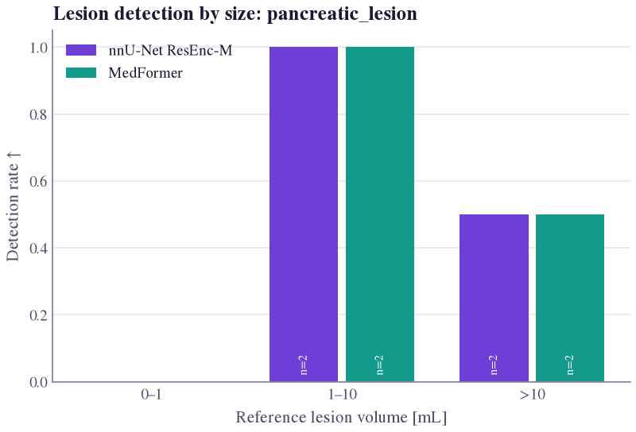

# Detection & instance metrics

A voxel Dice of 0.97 can hide a model that finds the one large tumour and misses every small metastasis. When the
question is **"were the lesions found?"**, count lesions, not voxels. Instance metrics (panoptic quality,
lesion-wise Dice) add per-lesion segmentation quality. Always report how lesions are defined and matched.

<figure class="sk-fig sk-fig--plot" markdown>
[](../assets/showcase/detection_by_size.png)
<figcaption>Real output on 8 PanTS test CTs (an illustration, not a benchmark): neither nnU-Net nor MedFormer finds a lesion under 1 mL; both find the two 1–10 mL lesions and one of the two above 10 mL. <a href="../../analysis/plots/#lesion-detection"><code>detection_by_size</code></a>.</figcaption>
</figure>

## At a glance

| Metric | Counts | Matching | Answers |
|---|---|---|---|
| [Lesion recall](#lesion_recall) | reference lesions | configurable | fraction of lesions found? |
| [Lesion precision](#lesion_precision) | predicted components | configurable | fraction of detections real? |
| [Lesion F1](#lesion_f1) | both | configurable | found the lesions, and only them? |
| [Count difference](#lesion_count_difference) | components | none | lesion count right? |
| [FP lesions](#false_positive_lesions) | predicted components | configurable | how many false alarms? |
| [Missed lesions](#false_negative_lesions) | reference lesions | configurable | how many misses? |
| [Splits](#split_count) | reference lesions | any overlap | lesions broken into pieces? |
| [Merges](#merge_count) | predicted components | any overlap | lesions fused together? |
| [Panoptic quality](#panoptic_quality) | pairs | IoU > 0.5, Hungarian | detection × outline quality |
| [Lesion-wise Dice](#lesionwise_dice) | reference lesions + FPs | any overlap | Dice with every lesion weighted equally |

## Notation and matching

Lesions are the connected components of each mask (`connectivity=26` default, or 18, 6; an argument of
`PairContext`, `compute_metrics` and `Evaluator`). `min_component_voxels` (`min_lesion_voxels` in `Evaluator`)
drops smaller components from **both** masks before matching; 0 (default) keeps all. \(G_1,\dots,G_{N_G}\) are
reference lesions, \(P_1,\dots,P_{N_P}\) predicted components; \(TP_{\mathrm{les}}\), \(FP_{\mathrm{les}}\), \(FN_{\mathrm{les}}\) count
matched lesions, unmatched predictions and unmatched references.

| `criterion` | Pairing | A match is | \(TP_{\mathrm{les}}\) |
|---|---|---|---|
| `"overlap"` (default) | many-to-many (ISLES, autoPET, BraTS) | a predicted component covering ≥ `min_overlap` of a reference lesion's volume (any overlap if 0); grazing below it is an FP | recall/F1: detected reference lesions; precision: matched predicted components |
| `"iou"` | one-to-one, Hungarian max-IoU | a pair with \(\mathrm{IoU} >\) `iou_threshold` (strict; 0.5 makes matches unique, as in PQ) | same on both sides |

`criterion`, `iou_threshold` and `min_overlap` apply to `lesion_recall`, `lesion_precision`, `lesion_f1`,
`false_positive_lesions`, `false_negative_lesions`. `split_count`, `merge_count`, `lesionwise_dice` always use any
overlap; `panoptic_quality` always uses "iou" with its own `iou_threshold`; `lesion_count_difference` only counts.

## Metrics

<div class="sek-metric" markdown>

### Lesion-wise recall (L-TPR; detection sensitivity) {#lesion_recall}

<div class="sek-meta"><span class="sek-chip">lesion_recall</span><span class="sek-chip">[0, 1]</span><span class="sek-chip teal">↑ higher is better</span></div>

\[
\mathrm{L\text{-}TPR} = \frac{TP_{\mathrm{les}}}{TP_{\mathrm{les}} + FN_{\mathrm{les}}} = \frac{\#\,\text{detected reference lesions}}{N_G}
\]

**In words** The fraction of reference lesions detected, regardless of their size.

**Use when** Missing a lesion is the main clinical risk (metastases, MS lesions, nodules, stroke).

**Watch out** Trivially maximised by many components (pair with [precision](#lesion_precision)); under "overlap" one touching voxel detects a lesion.

??? info "Details: empty masks, parameters, reference"
    **Empty masks.** No reference lesions: 1 (`"best"`) or NaN if also no predicted components, else NaN (undefined). No predictions but reference lesions: 0. "Empty" = no components after `min_component_voxels` filtering.

    **Parameters.** `criterion="overlap"`, `iou_threshold=0.5`, `min_overlap=0.0`; raise `min_overlap` or use `"iou"` for a stricter definition.

    **Reference.** Hernandez Petzsche MR et al. ISLES 2022. *Scientific Data* 9, 762 (2022). [doi:10.1038/s41597-022-01875-5](https://doi.org/10.1038/s41597-022-01875-5). Maier-Hein L et al. Metrics reloaded. *Nature Methods* 21, 195–212 (2024). [doi:10.1038/s41592-023-02151-z](https://doi.org/10.1038/s41592-023-02151-z)

</div>

<div class="sek-metric" markdown>

### Lesion-wise precision (L-PPV) {#lesion_precision}

<div class="sek-meta"><span class="sek-chip">lesion_precision</span><span class="sek-chip">[0, 1]</span><span class="sek-chip teal">↑ higher is better</span></div>

\[
\mathrm{L\text{-}PPV} = \frac{TP_{\mathrm{les}}}{TP_{\mathrm{les}} + FP_{\mathrm{les}}} = \frac{\#\,\text{matched predicted components}}{N_P}
\]

**In words** The fraction of predicted lesions that correspond to a real lesion (one minus the false discovery rate).

**Use when** False alarms cost reading time or trigger unnecessary follow-up.

**Watch out** Trivially maximised by predicting only the most obvious lesion; under "overlap" a component merging three lesions counts once.

??? info "Details: empty masks, parameters, reference"
    **Empty masks.** No predicted components: 1 (`"best"`) or NaN if also no reference lesions, else NaN. No reference lesions but predictions: 0.

    **Parameters.** `criterion="overlap"`, `iou_threshold=0.5`, `min_overlap=0.0`.

    **Reference.** Maier-Hein et al. 2024. [doi:10.1038/s41592-023-02151-z](https://doi.org/10.1038/s41592-023-02151-z)

</div>

<div class="sek-metric" markdown>

### Lesion-wise F1 score (L-F1) {#lesion_f1}

<div class="sek-meta"><span class="sek-chip">lesion_f1</span><span class="sek-chip">[0, 1]</span><span class="sek-chip teal">↑ higher is better</span></div>

\[
\mathrm{L\text{-}F1} = \frac{2\,TP_{\mathrm{les}}}{2\,TP_{\mathrm{les}} + FP_{\mathrm{les}} + FN_{\mathrm{les}}}
\]

**In words** One number for "found the lesions, and only them": the harmonic mean of lesion precision and recall.

**Use when** You need a single detection score for multi-lesion disease (ISLES'22 primary metric).

**Watch out** Depends heavily on matching rule, connectivity and minimum lesion size; confluent lesions merge or split, so report the rule.

??? info "Details: empty masks, parameters, reference"
    **Convention.** Under "overlap", \(TP_{\mathrm{les}}\) is the number of detected reference lesions, as in the ISLES'22 code.

    **Empty masks.** No lesions in either mask: 1 (`"best"`) or NaN. Otherwise defined; one side empty gives 0.

    **Parameters.** `criterion="overlap"`, `iou_threshold=0.5`, `min_overlap=0.0`.

    **Reference.** Hernandez Petzsche et al. 2022 (ISLES'22). [doi:10.1038/s41597-022-01875-5](https://doi.org/10.1038/s41597-022-01875-5)

</div>

<div class="sek-metric" markdown>

### Absolute lesion count difference (|ΔN|) {#lesion_count_difference}

<div class="sek-meta"><span class="sek-chip">lesion_count_difference</span><span class="sek-chip">[0, ∞)</span><span class="sek-chip teal">↓ lower is better</span><span class="sek-chip orange">lesions</span></div>

\[
\lvert\Delta N\rvert = \lvert N_P - N_G\rvert
\]

**In words** How many more or fewer lesions were predicted than exist.

**Use when** Lesion count is itself clinical (MS lesion load, number of metastases); an ISLES'22 secondary metric.

**Watch out** No matching at all: missing three lesions and hallucinating three others gives 0, so read it next to lesion F1.

??? info "Details: empty masks, parameters, reference"
    **Empty masks.** Always defined; both empty gives 0.

    **Parameters.** None (uses `connectivity` and `min_component_voxels`).

    **Reference.** Hernandez Petzsche et al. 2022 (ISLES'22). [doi:10.1038/s41597-022-01875-5](https://doi.org/10.1038/s41597-022-01875-5)

</div>

<div class="sek-metric" markdown>

### False-positive lesion count (FP lesions) {#false_positive_lesions}

<div class="sek-meta"><span class="sek-chip">false_positive_lesions</span><span class="sek-chip">[0, ∞)</span><span class="sek-chip teal">↓ lower is better</span><span class="sek-chip orange">lesions</span></div>

\[
FP_{\mathrm{les}} = N_P - \#\,\text{matched predicted components}
\]

**In words** The number of predicted components that correspond to no reference lesion.

**Use when** Reporting false alarms per scan, the x-axis of FROC-style analyses.

**Watch out** Connectivity-dependent: a speckled prediction has many more FPs under 6- than 26-connectivity; use and report `min_component_voxels`.

??? info "Details: empty masks, parameters, reference"
    **Empty masks.** Always defined; 0 when the prediction has no components.

    **Parameters.** `criterion="overlap"`, `iou_threshold=0.5`, `min_overlap=0.0`.

    **Reference.** Maier-Hein et al. 2024. [doi:10.1038/s41592-023-02151-z](https://doi.org/10.1038/s41592-023-02151-z). FROC: Chakraborty DP, Berbaum KS. *Medical Physics* 31(8), 2313–2330 (2004). [doi:10.1118/1.1769352](https://doi.org/10.1118/1.1769352)

</div>

<div class="sek-metric" markdown>

### Missed lesion count (FN lesions) {#false_negative_lesions}

<div class="sek-meta"><span class="sek-chip">false_negative_lesions</span><span class="sek-chip">[0, ∞)</span><span class="sek-chip teal">↓ lower is better</span><span class="sek-chip orange">lesions</span></div>

\[
FN_{\mathrm{les}} = N_G - \#\,\text{detected reference lesions}
\]

**In words** The number of reference lesions that were not detected.

**Use when** Reporting misses per scan, or stratifying them by size with the [lesion table](#code).

**Watch out** A count hides which lesions were missed, and small ones are missed far more often; check sizes in `lesion_table`.

??? info "Details: empty masks, parameters, reference"
    **Empty masks.** Always defined; 0 when the reference has no components.

    **Parameters.** `criterion="overlap"`, `iou_threshold=0.5`, `min_overlap=0.0`.

    **Reference.** Maier-Hein et al. 2024. [doi:10.1038/s41592-023-02151-z](https://doi.org/10.1038/s41592-023-02151-z)

</div>

<div class="sek-metric" markdown>

### Split lesions (Splits) {#split_count}

<div class="sek-meta"><span class="sek-chip">split_count</span><span class="sek-chip">[0, ∞)</span><span class="sek-chip teal">↓ lower is better</span><span class="sek-chip orange">lesions</span></div>

\[
\mathrm{Splits} = \#\{\, i : \lvert\{ j : P_j\cap G_i\neq\emptyset\}\rvert > 1 \,\}
\]

**In words** The number of reference lesions covered by more than one predicted component (over-fragmentation).

**Use when** A model breaks elongated or confluent lesions apart; splits are invisible to voxel Dice and "overlap" lesion F1.

**Watch out** Counts affected lesions, not pieces (a lesion split in four counts 1), and depends on connectivity.

??? info "Details: empty masks, parameters, reference"
    **Empty masks.** Always defined; 0 when either mask has no components.

    **Parameters.** None (always any-overlap matching).

    **Reference.** Maier-Hein et al. 2024. [doi:10.1038/s41592-023-02151-z](https://doi.org/10.1038/s41592-023-02151-z). Carass A et al. Refined Sørensen-Dice analysis. *Scientific Reports* 10, 8242 (2020). [doi:10.1038/s41598-020-64803-w](https://doi.org/10.1038/s41598-020-64803-w)

</div>

<div class="sek-metric" markdown>

### Merged lesions (Merges) {#merge_count}

<div class="sek-meta"><span class="sek-chip">merge_count</span><span class="sek-chip">[0, ∞)</span><span class="sek-chip teal">↓ lower is better</span><span class="sek-chip orange">lesions</span></div>

\[
\mathrm{Merges} = \#\{\, j : \lvert\{ i : P_j\cap G_i\neq\emptyset\}\rvert > 1 \,\}
\]

**In words** The number of predicted components covering more than one reference lesion (under-separation).

**Use when** Neighbouring lesions must be kept apart (metastasis counting, vertebra or tooth labelling).

**Watch out** Counts merged components, not lesions swallowed; two lesions touching at a corner are one under 26-connectivity, two under 6.

??? info "Details: empty masks, parameters, reference"
    **Example.** Two reference lesions predicted as one bridged blob: lesion recall, precision and F1 all 1 under "overlap", but one merge and PQ 0.

    **Empty masks.** Always defined; 0 when either mask has no components.

    **Parameters.** None (always any-overlap matching).

    **Reference.** Maier-Hein et al. 2024, [doi:10.1038/s41592-023-02151-z](https://doi.org/10.1038/s41592-023-02151-z); Carass et al. 2020, [doi:10.1038/s41598-020-64803-w](https://doi.org/10.1038/s41598-020-64803-w)

</div>

<div class="sek-metric" markdown>

### Panoptic quality (PQ) {#panoptic_quality}

<div class="sek-meta"><span class="sek-chip">panoptic_quality · pq</span><span class="sek-chip">[0, 1]</span><span class="sek-chip teal">↑ higher is better</span></div>

\[
\mathrm{PQ} = \underbrace{\frac{\sum_{(p,g)\in TP}\mathrm{IoU}(p,g)}{\lvert TP\rvert}}_{SQ}\times
\underbrace{\frac{\lvert TP\rvert}{\lvert TP\rvert + \tfrac12\lvert FP\rvert + \tfrac12\lvert FN\rvert}}_{RQ}
= \frac{\sum_{(p,g)\in TP}\mathrm{IoU}(p,g)}{\lvert TP\rvert + \tfrac12\lvert FP\rvert + \tfrac12\lvert FN\rvert}
\]

**In words** Detection quality (RQ, the F1 of matches) times segmentation quality (SQ, mean IoU of matched pairs).

**Use when** Evaluating instance segmentation (lesions, vertebrae, cells); recommended by Metrics Reloaded.

**Watch out** A lesion just below the IoU threshold counts as both FN and FP; splits and merges are punished hard.

??? info "Details: empty masks, parameters, reference"
    **Matching.** One-to-one pairs with \(\mathrm{IoU} > 0.5\) (Hungarian). A merge of two lesions gives 0 matches. Averaging PQ per image differs from pooling TP/FP/FN over the dataset.

    **Empty masks.** No instances in either mask: 1 (`"best"`) or NaN. One side without instances: 0.

    **Parameters.** `iou_threshold=0.5`.

    **Reference.** Kirillov A, He K, Girshick R, Rother C, Dollár P. Panoptic segmentation. *CVPR 2019*, 9404–9413. [arXiv:1801.00868](https://arxiv.org/abs/1801.00868)

</div>

<div class="sek-metric" markdown>

### Lesion-wise Dice (LW-DSC; BraTS 2023) {#lesionwise_dice}

<div class="sek-meta"><span class="sek-chip">lesionwise_dice</span><span class="sek-chip">[0, 1]</span><span class="sek-chip teal">↑ higher is better</span></div>

\[
\mathrm{LW\text{-}DSC} = \frac{1}{N_G + FP_{\mathrm{les}}}\sum_{i=1}^{N_G}
\mathrm{DSC}\Big(G_i,\ \textstyle\bigcup_{j:\, P_j\cap G_i\neq\emptyset} P_j\Big)
\]

**In words** Per-lesion Dice averaged, with every missed lesion and false-positive component scoring 0.

**Use when** Multi-focal disease, where whole-volume Dice is dominated by the largest lesion (BraTS 2023 protocol).

**Watch out** One large component touching two lesions counts for both; no dilation or volume threshold, unlike official BraTS code.

??? info "Details: empty masks, parameters, reference"
    **Example.** A missed 27-voxel metastasis weighs as much as a well-segmented 8000-voxel tumour.

    **BraTS difference.** Each reference lesion is compared with the union of predicted components touching it. The official code dilates each lesion (1–3 iterations, by sub-challenge) and drops small reference lesions (50 mm³ for most sub-challenges); to reproduce, pass a dilated reference and set `min_lesion_voxels` (filters both masks).

    **Empty masks.** No reference lesions and no FPs: 1 (`"best"`) or NaN. Empty reference with predictions: 0. Empty prediction with reference lesions: 0.

    **Parameters.** None (always any-overlap matching).

    **Reference.** Kazerooni AF et al. BraTS 2023: focus on pediatrics. [arXiv:2305.17033](https://arxiv.org/abs/2305.17033) (2023). Evaluation code: [rachitsaluja/BraTS-2023-Metrics](https://github.com/rachitsaluja/BraTS-2023-Metrics)

</div>

## Code

The `detection` set holds all ten metrics. One large lesion is found, three small ones are missed, one FP is added:

```python
import numpy as np
from segevalkit.metrics import compute_metrics, PairContext, lesion_table

ref = np.zeros((48, 48, 48), bool)
ref[4:24, 4:24, 4:24] = True                         # one large lesion (8000 voxels)
for z in (30, 36, 42):
    ref[z:z + 3, 30:33, 30:33] = True                # three 27-voxel lesions
pred = np.zeros_like(ref)
pred[5:24, 4:24, 4:24] = True                        # large lesion found
pred[40:43, 5:8, 5:8] = True                         # one false positive

scores = compute_metrics(pred, ref, ["dice", "detection"])
ctx = PairContext(pred, ref, spacing=(1, 1, 1), connectivity=26)
rows = lesion_table(ctx)   # one row per reference lesion and per unmatched prediction
```

```text
dice 0.9677   lesion_recall 0.2500   lesion_precision 0.5000   lesion_f1 0.3333
panoptic_quality 0.3167   lesionwise_dice 0.1949   lesion_count_difference 2
false_positive_lesions 1   false_negative_lesions 3   split_count 0   merge_count 0
```

Voxel Dice 0.97, lesion recall 0.25. The lesion table (also collected by `Evaluator` whenever a detection metric
runs) has columns `kind`, `component`, `volume_ml`, `detected`, `dice`, `iou`, `n_touching`. Matching options go in
`params`, e.g. `params={k: {"criterion": "iou"} for k in keys}`, with `connectivity=6` or
`min_component_voxels=30` as keywords. A 30-voxel threshold here would drop the three missed lesions and the FP
from both masks and give perfect scores: choose the minimum size from the clinical lesion definition, and report it.

!!! note "FROC"
    FROC curves and the LUNA16 CPM need a confidence score per predicted lesion; combine the lesion table with your model's lesion scores.
